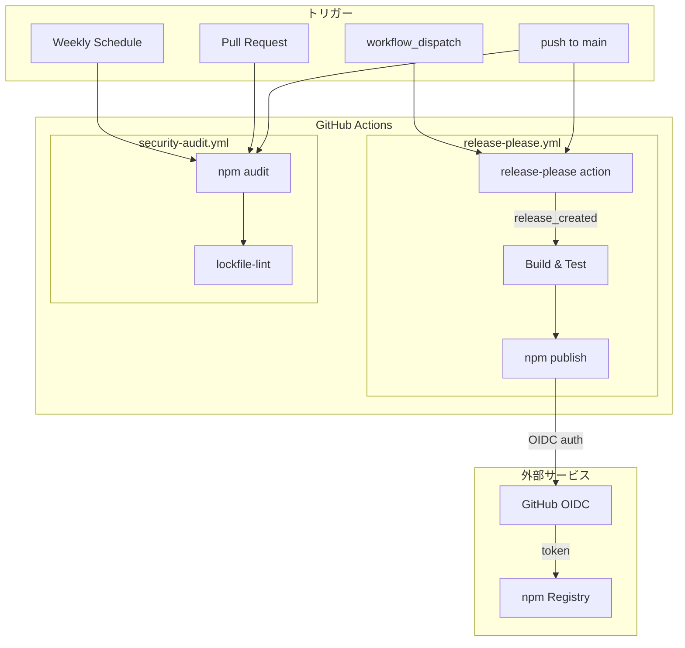
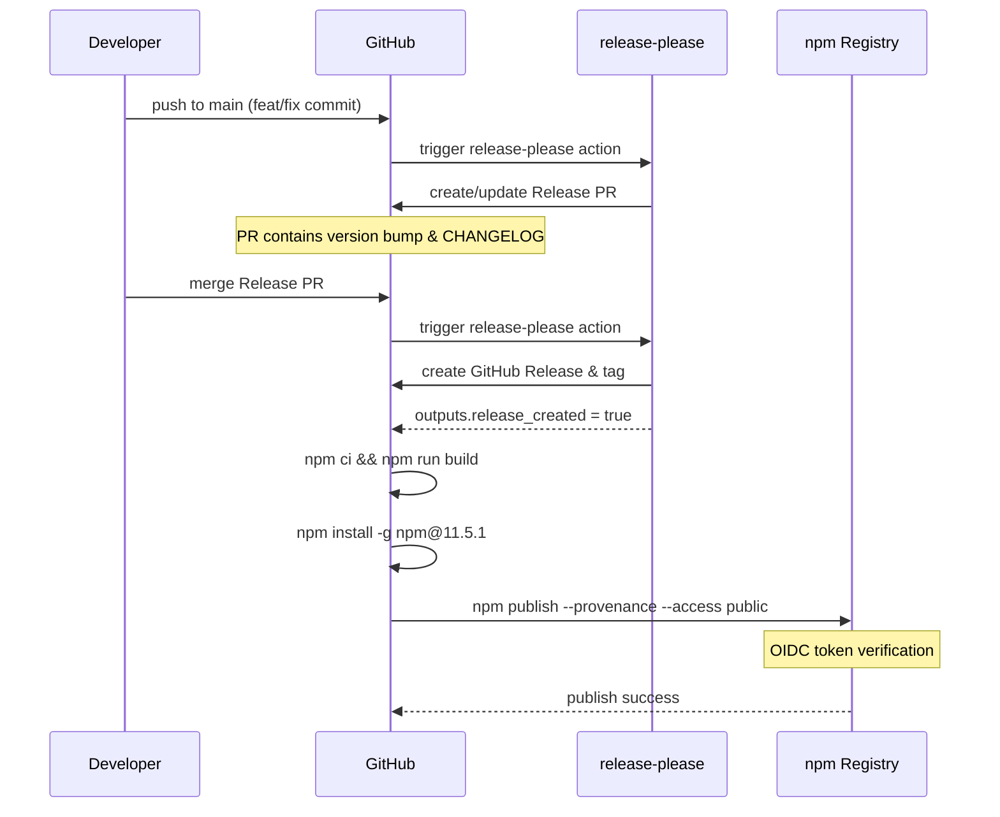
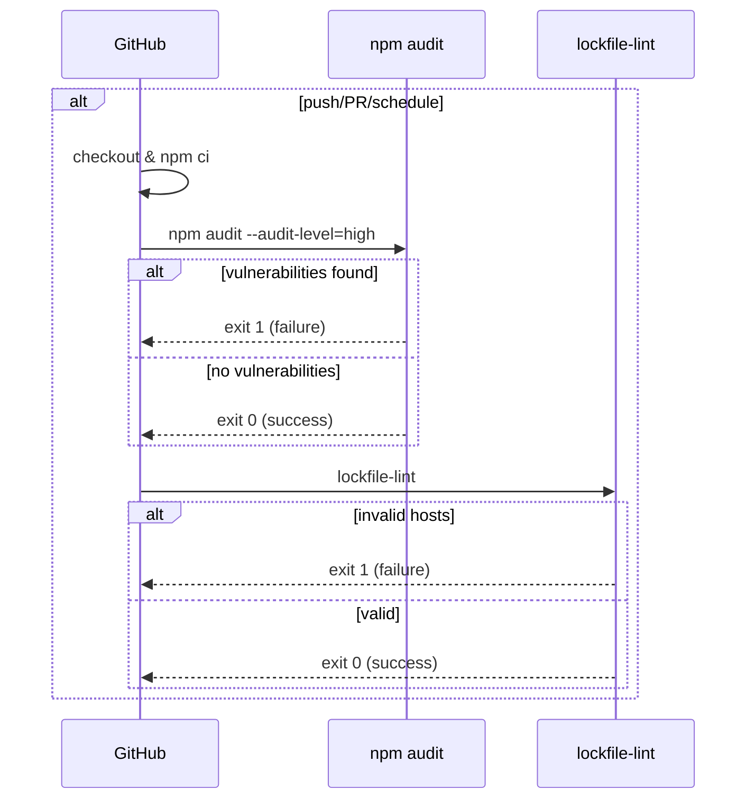

# CI/CDパイプライン 設計

関連: [requirements](requirements.md) | [CLI設計](../CLI/design.md)

## 概要
**目的**: この機能は開発者に自動化されたnpmパブリッシュパイプラインを提供します。
**ユーザー**: パッケージメンテナーがリリース作業のためにこれを利用します。
**影響**: GitHub Actionsワークフローと設定ファイルの追加によってCI/CD環境を変更します。

## ゴール
- mainブランチへのプッシュで自動的にリリースPRを作成
- リリースPRマージ時に自動でnpm publish
- npmトークン管理の排除（OIDC認証）
- 依存関係の脆弱性を継続的に監視

## 非ゴール
- 複数パッケージのmonorepo対応
- npm以外のレジストリへの公開
- 自動マージ機能

## アーキテクチャ

### アーキテクチャパターンと境界マップ



**アーキテクチャ統合**:
- 選択されたパターン: release-please + OIDC Trusted Publishing
- ドメイン/機能境界: Trigger → release-please → Build → Publish の単方向フロー
- 保持される既存パターン: npm scriptsによるビルド、package.jsonのbin設定
- 新規コンポーネントの根拠: GitHub Actionsによる自動化、OIDC認証によるセキュリティ強化

### 技術スタック

| レイヤー | 選択/バージョン | 機能における役割 | 備考 |
|--------|---------------|----------------|-----|
| CI/CD | GitHub Actions | ワークフロー実行基盤 | クラウドランナー必須 |
| リリース管理 | release-please | バージョン管理・CHANGELOG生成 | Google製 |
| 認証 | OIDC Trusted Publishing | npm認証 | npmトークン不要 |
| Node.js | 22.x | ビルド・パブリッシュ実行 | LTS版 |
| npm | 11.5.1+ | パッケージ公開 | OIDC対応版 |
| セキュリティ | npm audit, lockfile-lint | 脆弱性検査 | 定期実行 |

## システムフロー

### リリースフロー



### セキュリティ監査フロー



## 要件トレーサビリティ

| 要件 | 概要 | コンポーネント | インターフェース |
|------|------|--------------|----------------|
| 1.1-1.4 | release-please設定 | release-please-config.json, .release-please-manifest.json | release-please action |
| 2.1-2.5 | OIDC認証 | release-please.yml | actions/setup-node, npm publish |
| 3.1-3.5 | リリースワークフロー | release-please.yml | GitHub Actions |
| 4.1-4.4 | セキュリティ監査 | security-audit.yml | npm audit, lockfile-lint |
| 5.1-5.3 | 設定ファイル構成 | .github/workflows/, *.json | - |
| 6.1-6.2 | Trusted Publisher設定 | npmjs.com | Web UI |

## コンポーネントとインターフェース

### release-please.yml

| フィールド | 詳細 |
|----------|------|
| 意図 | mainブランチへのプッシュで自動リリースを実行 |
| 要件 | 1.1-1.4, 2.1-2.5, 3.1-3.5 |

**責任と制約**
- release-pleaseによるリリースPR作成
- リリース時のnpm publish実行
- OIDC認証の使用

### security-audit.yml

| フィールド | 詳細 |
|----------|------|
| 意図 | 依存関係の脆弱性を定期的に検出 |
| 要件 | 4.1-4.4 |

### release-please-config.json

| フィールド | 詳細 |
|----------|------|
| 意図 | release-pleaseの動作設定 |
| 要件 | 1.3 |

**設定内容**

```json
{
  "packages": {
    ".": {
      "release-type": "node",
      "package-name": "md-open-browser",
      "changelog-path": "CHANGELOG.md"
    }
  }
}
```

### .release-please-manifest.json

| フィールド | 詳細 |
|----------|------|
| 意図 | 現在のバージョン番号を管理 |
| 要件 | 1.4 |

**設定内容**

```json
{
  ".": "1.0.0"
}
```

## ライブラリ使用仕様

### googleapis/release-please-action@v4

| API | シグネチャ | 使用例 | 備考 |
|-----|----------|-------|------|
| release-please-action | with: config-file, manifest-file | release-please-action@v4 | Google製 |
| outputs.release_created | boolean | steps.release.outputs.release_created | 条件分岐に使用 |

### actions/setup-node@v4

| API | シグネチャ | 使用例 | 備考 |
|-----|----------|-------|------|
| setup-node | with: node-version, registry-url | actions/setup-node@v4 | GitHub公式 |

### npm CLI

| API | シグネチャ | 使用例 | 備考 |
|-----|----------|-------|------|
| npm publish | npm publish [options] | npm publish --provenance --access public | v11.5.1+ |
| npm audit | npm audit [options] | npm audit --audit-level=high | 脆弱性検査 |

## コーディングパターン

### 条件付き実行パターン

```yaml
- name: Build
  if: ${{ steps.release.outputs.release_created }}
  run: npm run build
```

### 手動トリガーパターン

```yaml
on:
  workflow_dispatch:
    inputs:
      mode:
        description: "Mode"
        required: false
        default: "publish"
```

### Concurrency制御パターン

```yaml
concurrency:
  group: release-please-${{ github.ref }}
  cancel-in-progress: false
```

## テスト戦略

### テスト種類の選定

| 対象 | テスト種類 | 理由 |
|-----|----------|-----|
| ワークフロー構文 | 手動確認 | GitHub Actions UIで確認 |
| release-please | 実際のpush | PRが作成されることを確認 |
| npm publish | dry-run | `npm publish --dry-run`で事前確認 |

### 動作確認手順

1. ワークフローファイルをpush
2. GitHub Actionsタブでワークフロー構文エラーがないことを確認
3. Conventional Commitsでpush
4. release-pleaseがPRを作成することを確認
5. PRをマージしてnpm publishが実行されることを確認

## 影響範囲

| 影響を受ける機能 | 影響の内容 | 影響レベル | 軽減策 |
|----------------|----------|----------|-------|
| リリースプロセス | 手動 → 自動化 | 高 | 手動publishジョブも用意 |
| npmトークン管理 | NPM_TOKEN → OIDC | 高 | 段階的移行 |
| CI時間 | ワークフロー追加 | 低 | 必要時のみ実行 |

## 注意事項

| カテゴリ | 注意点 | 詳細説明 | 防止策 |
|--------|-------|---------|-------|
| OIDC設定 | Trusted Publisher設定 | npmjs.comで事前設定が必要 | ドキュメントに手順記載 |
| npm version | v11.5.1以上必須 | OIDC対応版が必要 | ワークフローでアップグレード |
| ワークフロー名 | 正確に一致 | npmのTrusted Publisher設定と一致必須 | release-please.ymlを使用 |
| リポジトリ名 | 正確に一致 | 大文字小文字を区別 | rarudo/md-open-browserを使用 |
| パッケージ存在 | 事前作成必要 | OIDC設定前にパッケージが存在する必要 | 初回は手動publish |

## 初回セットアップ手順

1. **パッケージの初回publish（手動）**
   - `npm login`でログイン
   - `npm publish --access public`で初回公開

2. **npm Trusted Publisher設定（手動）**
   - npmjs.comでパッケージ設定を開く
   - Trusted Publisher → GitHub Actions を選択
   - Owner: rarudo, Repository: md-open-browser, Workflow: release-please.yml

3. **GitHub Actionsワークフロー追加**
   - .github/workflows/release-please.yml
   - .github/workflows/security-audit.yml
   - release-please-config.json
   - .release-please-manifest.json

4. **動作確認**
   - feat: またはfix:のコミットでpush
   - release-pleaseがPRを作成することを確認
