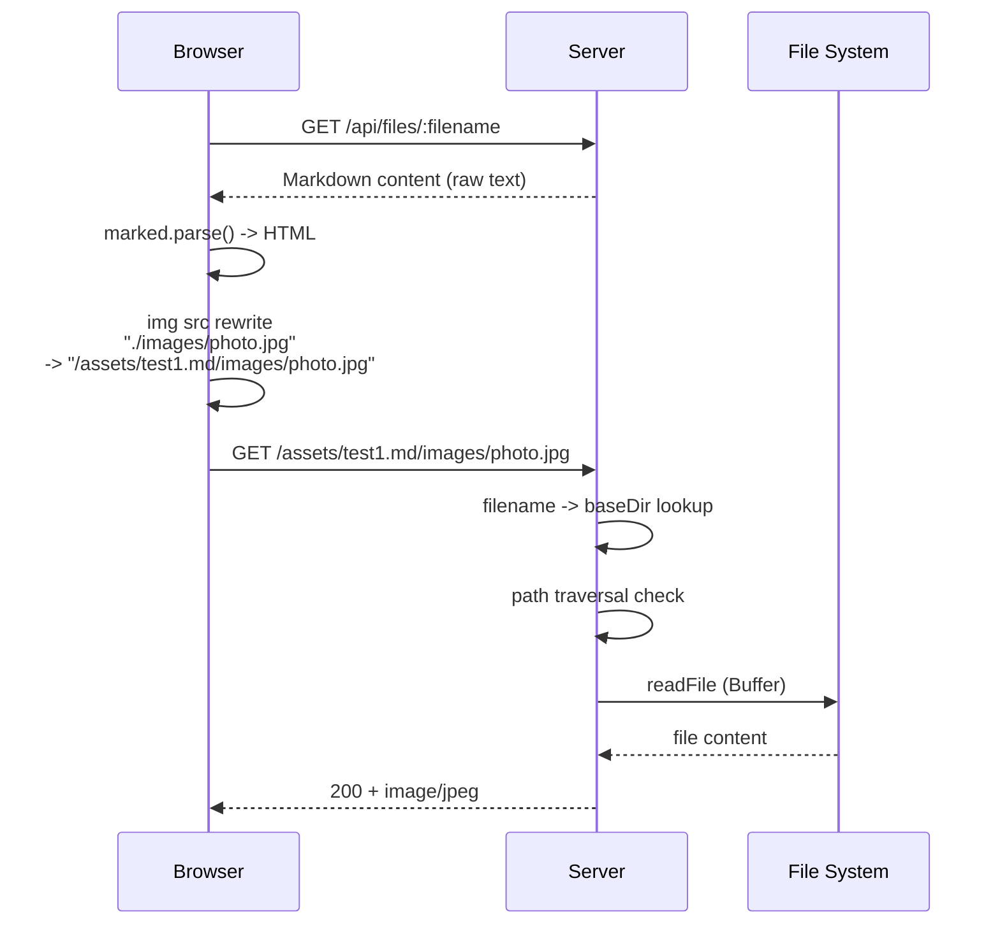

# ローカルアセット配信 設計

関連: [requirements](requirements.md) | [CLI design](../design.md)

## 概要
**目的**: この機能はMarkdownプレビューユーザーに、ドキュメント内で参照されるローカル画像を正しく表示する価値を提供します。
**ユーザー**: Markdownドキュメントに画像を含む開発者やドキュメント作成者がこれを利用します。
**影響**: 既存のHTTPサーバーに新規ルートを追加し、フロントエンドのレンダリング処理にURL書き換えロジックを追加します。既存APIへの変更はありません。

## ゴール
- Markdownから参照される相対パスの画像をプレビューに表示
- パストラバーサル攻撃からの保護
- 追加依存なし（Node.js標準APIのみ）

## 非ゴール
- `<a>`タグのhref書き換え（ファイルリンク）
- `<video>`/`<audio>`タグの対応
- Markdownファイルの親ディレクトリ外のファイル配信
- ストリーミング配信（大容量ファイル対応）

## アーキテクチャ

### アセット配信フロー



### ルーティング配置

```
既存ルート:
  /api/files          -> ファイルリストJSON
  /api/files/:name    -> Markdownコンテンツ
  /api/tmux/*         -> tmux操作
  / | /index.html     -> メインページ

新規ルート（/index.html と static fallback の間に配置）:
  /assets/:filename/** -> ローカルアセット配信  <- NEW

既存ルート（最後）:
  /* (static fallback) -> public/配下
```

## 要件トレーサビリティ

| 要件 | 概要 | コンポーネント | インターフェース |
|------|------|--------------|----------------|
| 1.1 | ファイル->ディレクトリマッピング | server.ts | fileBaseDirs |
| 1.2 | アセット配信ルート | server.ts | /assets/:filename/** |
| 1.3-1.5 | エラー処理・セキュリティ | server.ts | 404/403レスポンス |
| 1.6-1.7 | MIME判定拡張 | server.ts | getContentType() |
| 1.8 | バイナリ読み込み | server.ts | fs.readFile (Buffer) |
| 2.1-2.3 | URL書き換え | app.js | rewriteAssetUrls() |
| 2.4-2.5 | renderMarkdown拡張 | app.js | renderMarkdown(md, filename) |

## コンポーネントとインターフェース

### src/server.ts（変更）

| フィールド | 詳細 |
|----------|------|
| 意図 | ローカルアセット配信ルートの追加とMIME判定拡張 |
| 要件 | 1.1-1.8 |

**変更内容**
- `fileBaseDirs`マッピングの構築（サーバー起動時）
- `/assets/:filename/**` ルートハンドラーの追加
- `getContentType()`への画像MIME追加

**メソッド一覧**

| メソッドシグネチャ | 概要 | パラメータ | 戻り値 |
|------------------|------|----------|-------|
| (変更) `getContentType(filePath: string): string` | 画像MIMEタイプを追加 | filePath | MIMEタイプ文字列 |

### public/app.js（変更）

| フィールド | 詳細 |
|----------|------|
| 意図 | img要素の相対パスをアセットURLに書き換え |
| 要件 | 2.1-2.5 |

**変更内容**
- `renderMarkdown()`にfilename引数を追加
- `rewriteAssetUrls()`関数の追加
- `showFile()`からfilenameを伝播
- `init()`の初期表示呼び出しを更新

**メソッド一覧**

| メソッドシグネチャ | 概要 | パラメータ | 戻り値 |
|------------------|------|----------|-------|
| (変更) `renderMarkdown(markdown, filename)` | filename引数追加 | markdown, filename | void |
| (新規) `rewriteAssetUrls(container, filename)` | img src書き換え | container: Element, filename: string | void |

## セキュリティ設計

### パストラバーサル防止

```
リクエスト: GET /assets/test.md/../../etc/passwd

処理:
1. filename = "test.md" -> baseDir = "/home/user/docs/"
2. filepath = "../../etc/passwd"
3. resolved = path.resolve("/home/user/docs/", "../../etc/passwd")
           = "/home/etc/passwd"
4. check: "/home/etc/passwd".startsWith("/home/user/docs/" + sep) -> false
5. -> 403 Forbidden
```

### 前方一致の安全な検証

```typescript
// 危険: "/home/user/docs-evil/" が "/home/user/docs" にマッチする
absolutePath.startsWith(baseDir)  // NG

// 安全: 末尾にpath.sepを付与
absolutePath.startsWith(baseDir + path.sep) || absolutePath === baseDir  // OK
```

## エラー処理

### エラーカテゴリと対応
- **不明なファイル名**: filenameがマッピングに存在しない -> 404
- **ファイル不在**: ファイルシステム上にない -> 404
- **パストラバーサル**: ベースディレクトリ外への参照 -> 403
- **読み取りエラー**: ファイルI/O失敗 -> 404

## テスト戦略

### テスト種類の選定

| 対象 | テスト種類 | 理由 |
|-----|----------|-----|
| /assets/ ルート | 統合テスト | HTTP経由の実際のリクエスト/レスポンス確認 |
| パストラバーサル防止 | 統合テスト | セキュリティ要件の実証 |
| getContentType() | ユニットテスト | 純粋な関数のため（既存テストに追加可能） |

### 統合テスト
- 正常系: 画像ファイル取得、正しいContent-Type
- 異常系: 存在しないファイル、不明なfilename、パストラバーサル

## 影響範囲

| 影響を受ける機能 | 影響の内容 | 影響レベル | 軽減策 |
|----------------|----------|----------|-------|
| server.ts ルーティング | 新規ルート追加 | 低 | 既存ルートの後、static fallbackの前に配置 |
| app.js renderMarkdown | 引数追加 | 低 | 既存呼び出しを全て更新 |
| getContentType | MIME追加 | 低 | 既存判定に影響なし |

## 注意事項

| カテゴリ | 注意点 | 詳細説明 | 防止策 |
|--------|-------|---------|-------|
| セキュリティ | パストラバーサル | path.sep付きの前方一致チェック必須 | 要件1.5の実装 |
| データ破損 | バイナリ読み込み | 画像をUTF-8で読むとデータ破損 | fs.readFile(path)をエンコーディング指定なしで使用 |
| パス解決 | 相対パス | CLIから渡されるファイルパスは相対の可能性 | path.resolve()で絶対パスに変換 |
| 同名ファイル | basename衝突 | 異なるディレクトリの同名ファイルは先に見つかったものが使われる | 既存/api/files/:filenameと同じ制約。将来の改善候補 |
