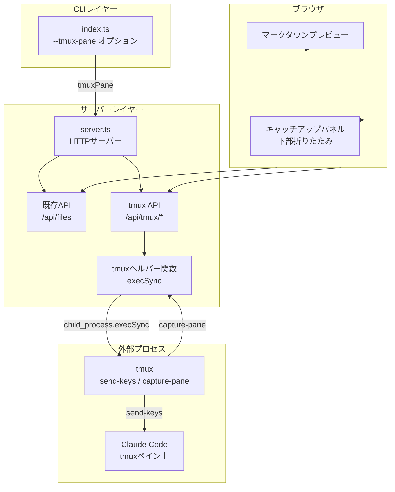
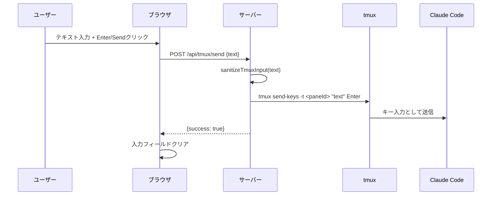
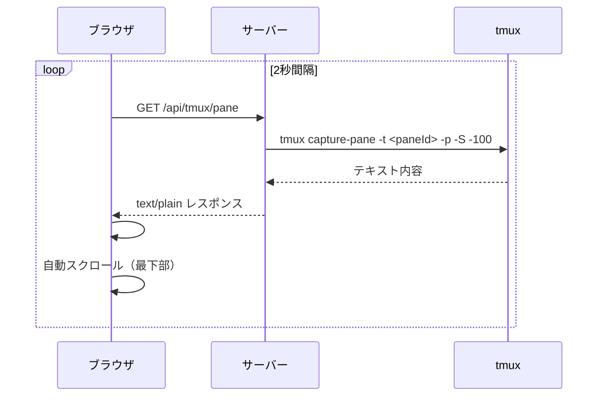
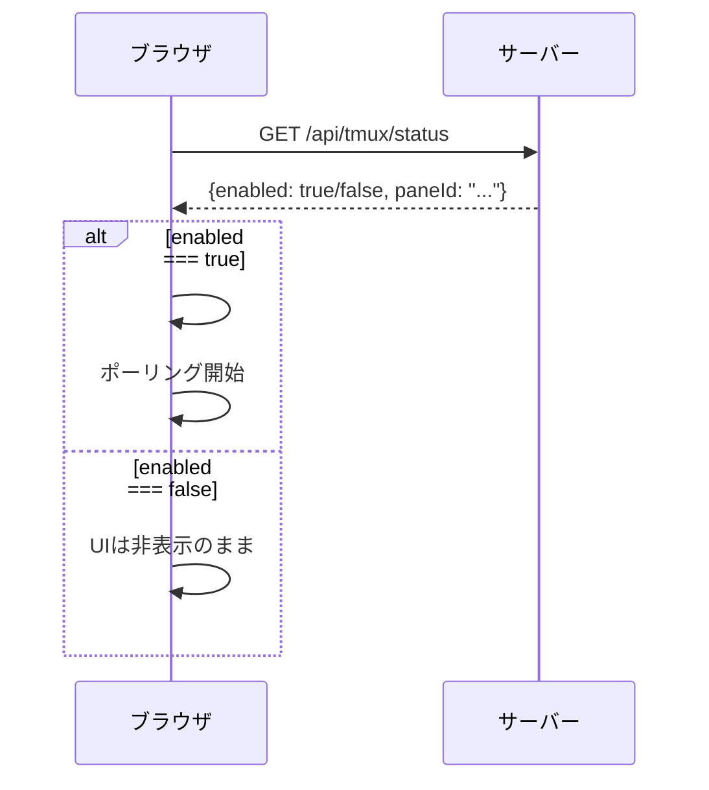
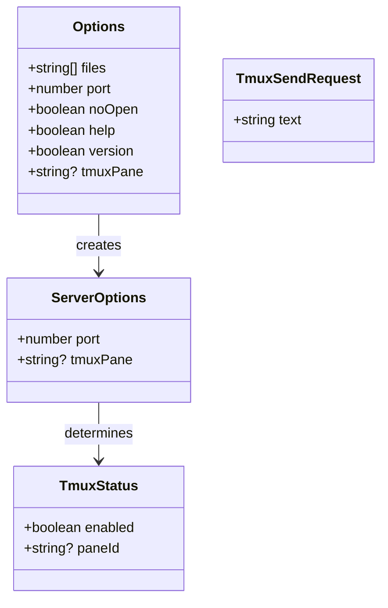

# tmuxキャッチアップUI 設計

関連: [requirements](requirements.md)

## 概要
**目的**: この機能はClaude Codeユーザーに、ブラウザ上のマークダウンプレビューからtmux上のClaude Codeへ直接質問を送信し、応答を確認できる価値を提供します。
**ユーザー**: Claude Codeをtmux環境で使用する開発者が、仕様書レビュー中に疑問点を即座にClaude Codeへフィードバックするためにこれを利用します。
**影響**: CLI引数解析、HTTPサーバーAPI、フロントエンドUIへの拡張を行います。

## ゴール
- ブラウザUIからtmux上のClaude Codeにテキスト入力を送信できる
- Claude Codeペインの出力内容をブラウザ上でプレーンテキストとして閲覧できる
- tmux環境以外では一切の影響がない（オプトイン方式）

## 非ゴール
- ~~ANSIカラーコードの再現（プレーンテキスト表示のみ）~~ → 決定9でttyd統合により解決
- ~~xterm.jsなどの本格的なターミナルエミュレーション~~ → 決定9でttyd統合により解決
- WebSocketによるリアルタイム通信（自前実装としては非ゴール。ttydが内部で使用）
- tmuxセッションやウィンドウの管理操作
- 認証や権限管理（ローカル環境での使用を前提）

## アーキテクチャ

### アーキテクチャパターンと境界マップ



**アーキテクチャ統合**:
- 選択されたパターン: 既存HTTPサーバーにAPIエンドポイントを追加し、child_process.execSyncでtmuxコマンドを実行する
- ドメイン/機能境界: CLIはtmuxペイン情報の受け渡し、Serverはtmuxコマンド実行のプロキシ、Clientはキャッチアップ操作UI
- 保持される既存パターン: HTTPサーバー、静的ファイル配信、CLIオプション解析
- 新規コンポーネントの根拠: tmuxヘルパー関数（コマンド実行の安全な抽象化）、キャッチアップパネル（専用UI）

### 技術スタック

| レイヤー | 選択/バージョン | 機能における役割 | 備考 |
|--------|---------------|----------------|-----|
| CLIオプション | util.parseArgs | --tmux-paneオプション解析 | 既存の仕組みに追加 |
| tmux連携 | child_process.execSync | tmuxコマンド実行 | Node.js標準API、外部依存なし |
| HTTPサーバー | http標準モジュール | tmux APIエンドポイント | 既存サーバーに追加 |
| フロントエンド | vanilla JS | キャッチアップパネルUI | 追加ライブラリなし |

## システムフロー

### 質問送信フロー



### ペイン内容取得フロー（ポーリング）



### 初期化フロー



## 要件トレーサビリティ

| 要件 | 概要 | コンポーネント | インターフェース |
|------|------|--------------|----------------|
| 1.1 | --tmux-paneオプション | index.ts | parseOptions() |
| 1.2 | オプション未指定時のUI非表示 | app.js | initTmuxCatchup() |
| 1.3 | ペイン情報のサーバー受け渡し | index.ts, server.ts | ServerOptions.tmuxPane |
| 1.5-1.7 | --use-claude-codeオプション | index.ts | parseOptions(), main() |
| 2.1 | tmuxステータスAPI | server.ts | GET /api/tmux/status |
| 2.2 | ペイン内容取得API | server.ts | GET /api/tmux/pane |
| 2.3 | テキスト送信API | server.ts | POST /api/tmux/send |
| 2.4-2.6 | 入力サニタイズ・エラー処理 | server.ts | sanitizeTmuxInput(), parseTmuxRequestBody() |
| 3.1 | キャッチアップパネル配置 | index.html, styles.css | .tmux-panel |
| 3.2, 3.15 | テキスト入力・送信UI（IME対応） | index.html, app.js | #tmux-input, #tmux-send, isComposing |
| 3.3 | ペイン出力表示 | app.js | fetchTmuxPaneContent() |
| 3.4 | ポーリング制御 | app.js | startTmuxPolling(), stopTmuxPolling() |
| 3.5 | パネル折りたたみ | styles.css, app.js | .tmux-panel-body.collapsed |
| 3.6 | 自動スクロール | app.js | scrollTop = scrollHeight |
| 3.16-3.18 | 複数行入力対応 | index.html, styles.css, app.js | textarea#tmux-input |
| 4.5-4.6 | スクロール位置保持 | styles.css | .tmux-output height固定 |

## コンポーネントとインターフェース

### CLIレイヤー

#### src/index.ts（変更）

| フィールド | 詳細 |
|----------|------|
| 意図 | --tmux-pane CLIオプションの追加とサーバーへの受け渡し |
| 要件 | 1.1, 1.3 |

**責任と制約**
- `--tmux-pane <pane_id>` オプションを解析
- ペイン情報をServerOptionsに含めてstartServerに渡す

**依存関係**
- インバウンド: ユーザー入力（CLI引数）
- アウトバウンド: server.ts -- ServerOptions.tmuxPane

**メソッド一覧**

| メソッドシグネチャ | 概要 | パラメータ | 戻り値 |
|------------------|------|----------|-------|
| `parseOptions(args: string[]): Options` | 引数解析（tmuxPane追加） | args: CLI引数 | Options（tmuxPane含む） |

### サーバーレイヤー

#### src/server.ts（変更）

| フィールド | 詳細 |
|----------|------|
| 意図 | tmux APIエンドポイントの提供とtmuxコマンドの安全な実行 |
| 要件 | 2.1-2.6 |

**責任と制約**
- tmux APIエンドポイント3つを提供
- tmuxコマンドをchild_process.execSyncで実行
- 入力のサニタイズとボディサイズ制限

**依存関係**
- インバウンド: index.ts -- ServerOptions.tmuxPane、ブラウザ -- HTTP API
- アウトバウンド: tmuxプロセス -- execSync

**メソッド一覧**

| メソッドシグネチャ | 概要 | パラメータ | 戻り値 |
|------------------|------|----------|-------|
| `sanitizeTmuxInput(text: string): string` | 制御文字除去 | text: ユーザー入力 | サニタイズ済みテキスト |
| `tmuxCapturePaneContent(paneId: string): string` | ペイン内容取得 | paneId: tmuxペインID | ペインのテキスト内容 |
| `tmuxSendKeys(paneId: string, text: string): void` | テキスト送信 | paneId, text | なし |
| `parseTmuxRequestBody(req: IncomingMessage): Promise<string>` | POSTボディ解析 | req: HTTPリクエスト | ボディ文字列 |

### フロントエンドレイヤー

#### public/app.js（変更）

| フィールド | 詳細 |
|----------|------|
| 意図 | キャッチアップパネルのUI制御（初期化、ポーリング、送信、折りたたみ） |
| 要件 | 3.1-3.6 |

**責任と制約**
- /api/tmux/statusの確認とパネル表示/非表示制御
- 2秒間隔のポーリングによるペイン内容取得
- テキスト送信とUI状態管理
- パネル折りたたみ時のポーリング停止

**メソッド一覧**

| メソッドシグネチャ | 概要 | パラメータ | 戻り値 |
|------------------|------|----------|-------|
| `initTmuxCatchup(): Promise<void>` | tmux機能の初期化 | なし | void |
| `setupTmuxEventListeners(): void` | イベントリスナー設定 | なし | void |
| `sendTmuxMessage(): Promise<void>` | テキスト送信 | なし | void |
| `fetchTmuxPaneContent(): Promise<void>` | ペイン内容取得・表示 | なし | void |
| `startTmuxPolling(): void` | ポーリング開始 | なし | void |
| `stopTmuxPolling(): void` | ポーリング停止 | なし | void |

### クラス構造図



## データモデル

### TmuxStatus（APIレスポンス）

| フィールド | 詳細 |
|----------|------|
| 意図 | tmux連携の有効状態をフロントエンドに通知 |
| 要件 | 2.1 |

**フィールド定義**

| フィールド名 | 型 | 説明 |
|------------|---|-----|
| enabled | boolean | tmux連携が有効かどうか |
| paneId | string / null | tmuxペインID（無効時null） |

### TmuxSendRequest（APIリクエスト）

| フィールド | 詳細 |
|----------|------|
| 意図 | ブラウザからClaude Codeへ送信するテキスト |
| 要件 | 2.3 |

**フィールド定義**

| フィールド名 | 型 | 説明 |
|------------|---|-----|
| text | string | 送信するテキスト |

## エラー処理

### エラーカテゴリと対応
- **ユーザーエラー**: textフィールド未指定 -> 400レスポンス
- **システムエラー**: tmuxコマンド実行失敗 -> エラーメッセージ返却（ペイン取得時）/ 500レスポンス（送信時）
- **設定エラー**: tmux-pane未指定でtmux APIアクセス -> 404レスポンス

## コーディングパターン

### tmuxコマンド実行パターン
```typescript
import { execSync } from "child_process";

// ペイン内容取得
function tmuxCapturePaneContent(paneId: string): string {
  try {
    return execSync(
      `tmux capture-pane -t ${JSON.stringify(paneId)} -p -S -100`,
      { encoding: "utf-8", timeout: 5000 }
    );
  } catch {
    return "[Error: Failed to capture tmux pane content]";
  }
}
```

### 入力サニタイズパターン
```typescript
// 制御文字（タブ・改行以外）を除去
function sanitizeTmuxInput(text: string): string {
  return text.replace(/[\x00-\x08\x0b\x0c\x0e-\x1f]/g, "");
}
```

### POSTリクエストボディ解析パターン
```typescript
function parseTmuxRequestBody(req: http.IncomingMessage): Promise<string> {
  return new Promise((resolve, reject) => {
    let body = "";
    req.on("data", (chunk: Buffer) => {
      body += chunk.toString();
      if (body.length > 10240) reject(new Error("Request body too large"));
    });
    req.on("end", () => resolve(body));
    req.on("error", reject);
  });
}
```

## テスト戦略

### テスト種類の選定

| 対象 | テスト種類 | 理由 |
|-----|----------|-----|
| parseOptions(tmux-pane) | ユニットテスト | 純粋な引数解析のため |
| GET /api/tmux/status | 統合テスト | APIレスポンスの確認 |
| tmux無効時の404 | 統合テスト | エラーハンドリングの確認 |
| capture-pane/send-keys | 手動テスト | 実際のtmux環境が必要 |

### ユニットテスト
- parseOptions: --tmux-paneオプションの解析を検証
- parseOptions: --tmux-pane未指定時のundefinedを検証

### 統合テスト
- GET /api/tmux/status: tmux有効時のレスポンス確認
- GET /api/tmux/status: tmux無効時のレスポンス確認
- GET /api/tmux/pane: tmux無効時の404確認
- POST /api/tmux/send: tmux無効時の404確認

### 手動確認項目
- tmux環境でmd-open --tmux-pane起動時にキャッチアップパネルが表示される
- テキスト入力がClaude Codeペインに送信される
- ペインの出力がブラウザに表示される
- パネル折りたたみ時にポーリングが停止する
- tmux-pane未指定時にパネルが表示されない

## 影響範囲

| 影響を受ける機能 | 影響の内容 | 影響レベル | 軽減策 |
|----------------|----------|----------|-------|
| マークダウンプレビュー | .contentにflex-direction: column追加 | 中 | .markdown-bodyにflex: 1とoverflow-y: auto追加で従来表示を維持 |
| CLIオプション解析 | --tmux-pane、--use-claude-codeオプション追加 | 低 | 既存オプションに影響しない追加のみ |
| HTTPサーバー | /api/tmux/* エンドポイント追加 | 低 | 既存エンドポイントに影響しない追加のみ |
| キャッチアップパネル入力 | input→textarea変更 | 中 | 既存の送信・IME対応ロジックを維持しつつ要素変更 |
| キャッチアップパネル出力 | .tmux-output高さ固定化 | 低 | 既にmax-height: 300pxの制約あり、固定化による視覚的な変化は最小限 |

## 注意事項

| カテゴリ | 注意点 | 詳細説明 | 防止策 |
|--------|-------|---------|-------|
| セキュリティ | コマンドインジェクション | tmux send-keysに渡すテキストの安全性 | JSON.stringifyでクォート、制御文字除去 |
| セキュリティ | XSS | capture-pane出力のブラウザ表示 | textContent使用（innerHTML不使用） |
| セキュリティ | DoS | 大きなリクエストボディ | 10KBサイズ制限 |
| パフォーマンス | ポーリング負荷 | 2秒間隔のHTTPリクエスト | パネル折りたたみ時はポーリング停止 |
| パフォーマンス | execSyncブロッキング | tmuxコマンド実行中のイベントループブロック | 5秒タイムアウト設定（tmuxコマンドは通常ミリ秒単位で完了） |
| 互換性 | tmux未インストール環境 | tmuxコマンドが見つからない場合のエラー | --tmux-paneオプション未指定時は一切のtmux操作を行わない |
| テスト | CI環境でのtmux不在 | tmuxがインストールされていないCI環境 | tmux依存テストはステータスAPIと404レスポンスのみ |

---

## 追加設計決定（v2）

### 決定6: --use-claude-codeオプションによる環境変数からのペインID自動取得

**What**: `--use-claude-code` booleanオプションを追加し、環境変数 `TMUX_PANE` からペインIDを自動取得する

**How**:
- ファイル: `src/index.ts`
- 実装方針: `parseOptions` に `--use-claude-code` を追加。`main` 関数で `--tmux-pane` が未指定かつ `--use-claude-code` が有効な場合に `process.env.TMUX_PANE` を使用

**Why（Core）**:

なぜこのアプローチ？
→ `--tmux-pane $TMUX_PANE` と毎回入力するのは冗長。booleanフラグ一つで環境変数から自動取得する方がユーザー体験が良い

なぜ `--use-claude-code` という名前？
→ tmuxペインの自動設定に限らず、将来的にClaude Code連携全般を示すフラグとして拡張可能。また、ユーザーがClaude Codeと併用する意図を明示できる

なぜ `--tmux-pane` を優先？
→ 明示的な指定は暗黙のデフォルトに勝る原則。ユーザーが特定ペインを指定したい場合にオーバーライドできるようにする

**検討した選択肢**:
- **booleanフラグ `--use-claude-code`（採用）**: シンプルで拡張性がある
- **`--tmux-pane` のデフォルト値を `$TMUX_PANE` に変更（却下）**: 意図せずtmux機能が有効化される可能性がありオプトイン原則に反する
- **`--tmux-pane auto` のような特殊値（却下）**: stringオプションの値に特殊な意味を持たせると解析が複雑になる

**トレードオフ**:
- 利点: ユーザーは `--use-claude-code` だけでtmux連携が有効化される
- 妥協: 新しいCLIオプションが1つ増える

### 決定7: テキスト入力フィールドの複数行対応

**What**: 入力フィールドを `<input type="text">` から `<textarea>` に変更し、複数行入力を可能にする

**How**:
- ファイル: `public/index.html`, `public/styles.css`, `public/app.js`
- 実装方針: HTMLの `<input>` を `<textarea>` に変更。CSSで初期高さ1行・最大4行のサイズ制御。JSで入力内容に応じた自動高さ調整とShift+Enterでの改行サポート

**Why（Core）**:

なぜ `<textarea>` ？
→ HTMLの仕様上、`<input type="text">` は単一行のみ対応。複数行入力には `<textarea>` が標準的な選択

なぜ自動拡張方式？
→ 固定の大きなテキストエリアはスペースの無駄になる。1行から最大4行まで自動拡張することで、通常時はコンパクト、長文入力時は十分な編集領域を提供

なぜEnterで送信、Shift+Enterで改行？
→ チャットUIの標準的な操作パターン。Slack、Discord等の既存ツールとの一貫性

**検討した選択肢**:
- **textarea + 自動拡張（採用）**: 直感的で標準的
- **contenteditable div（却下）**: XSSリスクが増加し、formとの統合も複雑
- **固定高さtextarea（却下）**: 1行入力時のスペース効率が悪い

**トレードオフ**:
- 利点: 複数行の質問やコードスニペットの貼り付けが可能
- 妥協: 自動拡張の高さ計算ロジックが追加される

### 決定8: tmuxポーリング中のスクロール位置保持

**What**: tmuxペイン出力のポーリング更新時に、マークダウンプレビュー領域のスクロール位置が変化しないようにする

**How**:
- ファイル: `public/styles.css`
- 実装方針: `.tmux-output` に固定の `height`（`min-height` と `max-height` を同じ値に設定、または `height` を固定値に）を適用し、内容量の変化がflex計算に影響しないようにする

**Why（Core）**:

なぜCSSで解決？
→ 根本原因は `.tmux-output` の内容量が変わるたびにフレックスアイテムの高さが再計算され、`.markdown-body` の高さが変動すること。出力エリアの高さを固定すれば、ポーリング更新時にレイアウト再計算が発生しない

なぜJSでのスクロール位置保存/復元ではないか？
→ JSでの保存/復元は、レイアウト変動→スクロールリセット→復元という一瞬のちらつきが発生しうる。CSSでレイアウト変動自体を防ぐ方が確実

**検討した選択肢**:
- **`.tmux-output` の高さ固定（採用）**: レイアウト変動の根本原因を排除
- **JS での scrollTop 保存/復元（却下）**: ちらつきのリスク、タイミング依存
- **`overflow-anchor: auto` CSS プロパティ（却下）**: ブラウザサポートが不完全で、スクロールアンカリングの意図と異なる

**トレードオフ**:
- 利点: ポーリング更新によるスクロール位置の意図しない変化を完全に防止
- 妥協: 出力エリアの高さが固定されるため、内容が少ない場合にも同じ高さを占有する

### 決定9: ttydによるWebターミナルエミュレーション（PoC）

**What**: 現在のプレーンテキスト表示+HTTPポーリング方式を、ttyd（外部ツール）によるWebターミナルエミュレーションに置き換える。キャッチアップパネル内にttydのWebUIをiframeで埋め込み、tmuxペインの完全なターミナル表示（ANSIカラー、カーソル移動、スクロール等）をブラウザ上で実現する。

**How**:
- ファイル: `src/index.ts`, `src/server.ts`, `public/app.js`, `public/index.html`, `public/styles.css`
- 外部ツール: ttyd（`brew install ttyd`等で事前インストールが必要）
- 実装方針:
  1. md-open-browser起動時に`ttyd`を子プロセスとして起動し、`tmux attach-session -t <session>`を実行
  2. ttydは専用ポート（md-open-browserのポート+1）でWebサーバーを起動
  3. フロントエンドのキャッチアップパネル内にiframeでttydのURLを埋め込み表示
  4. 既存のHTTPポーリング方式の`/api/tmux/pane`、`/api/tmux/send`は不要になる（ttydが直接双方向通信を提供）
  5. `/api/tmux/status`はttydのURL情報を返すように拡張

**Why（Core）**:

なぜttyd？
→ ttydはtmux/ptyの出力をWebSocket+xterm.jsで配信する成熟したツール。自前でxterm.js統合やWebSocket実装を行うよりも、信頼性・機能性ともに優れている。ANSIカラー、カーソル移動、マウス操作、リサイズ等の全ターミナル機能に対応

なぜiframe埋め込み？
→ ttydは独立したWebサーバーとして動作するため、同一ページ内に表示するにはiframeが最もシンプル。CORSやAPI統合の複雑さを回避できる

なぜ子プロセスとして起動？
→ md-open-browserのライフサイクルに合わせてttydを管理でき、md-open-browser終了時にttydも自動停止する。ユーザーが手動でttydを起動・管理する手間を省く

なぜ`tmux attach-session`？
→ `tmux attach-session`はtmuxペインに「直接アタッチ」するアプローチ。capture-pane経由のポーリングと違い、リアルタイムの双方向通信、完全なターミナルエミュレーションが実現される

**検討した選択肢**:
- **ttyd子プロセス + iframe（採用）**: 実装コスト最小、完全なターミナル体験、成熟したツールの活用
- **xterm.js + HTTPポーリング（却下）**: カラー表示は可能だが2秒遅延が固定的、画面のちらつき発生リスク
- **xterm.js + WebSocket自前実装（却下）**: 実装コスト中~高、wsライブラリの追加依存、pipe-pane等の複雑な連携が必要
- **GoTTY（却下）**: ttydと同様のアプローチだがメンテナンス状況がttydに劣る

**トレードオフ**:
- 利点: 完全なターミナルエミュレーション（カラー、カーソル、リサイズ、マウス）、リアルタイム表示、既存の自前ポーリング+送信コードが不要になり簡素化
- 妥協: ttydの外部バイナリへの依存（ユーザーが事前にインストールする必要がある）、ポート2つ使用
- PoC段階: まず動作検証を行い、本格採用の判断材料とする
