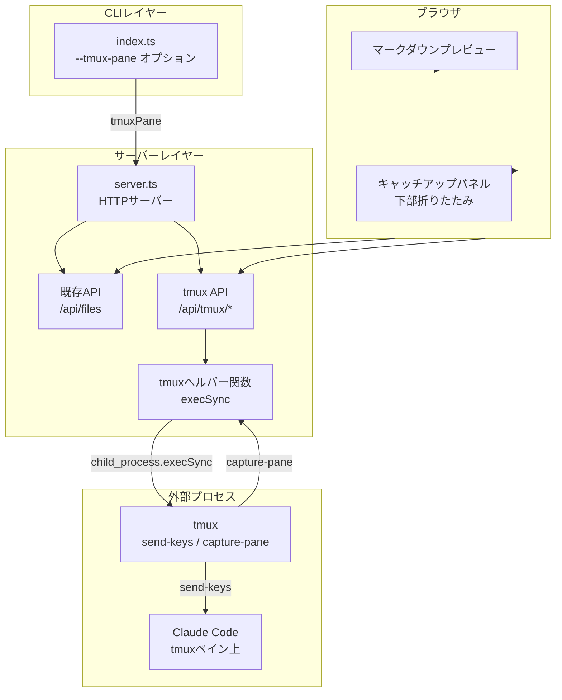
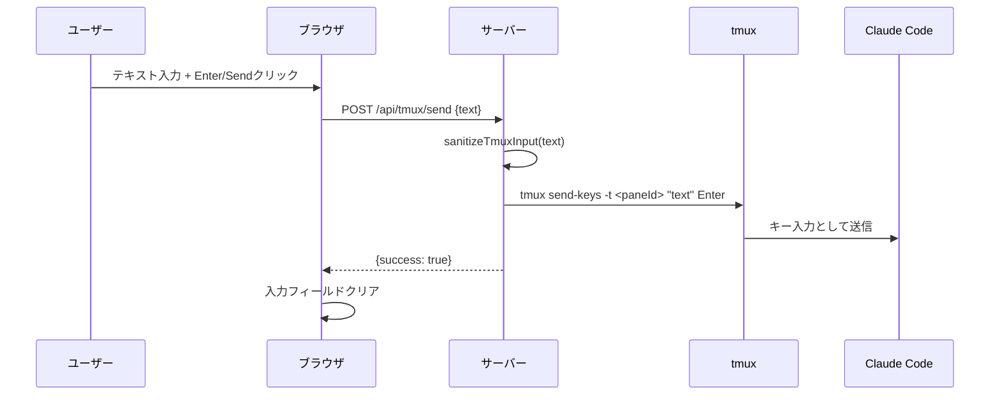
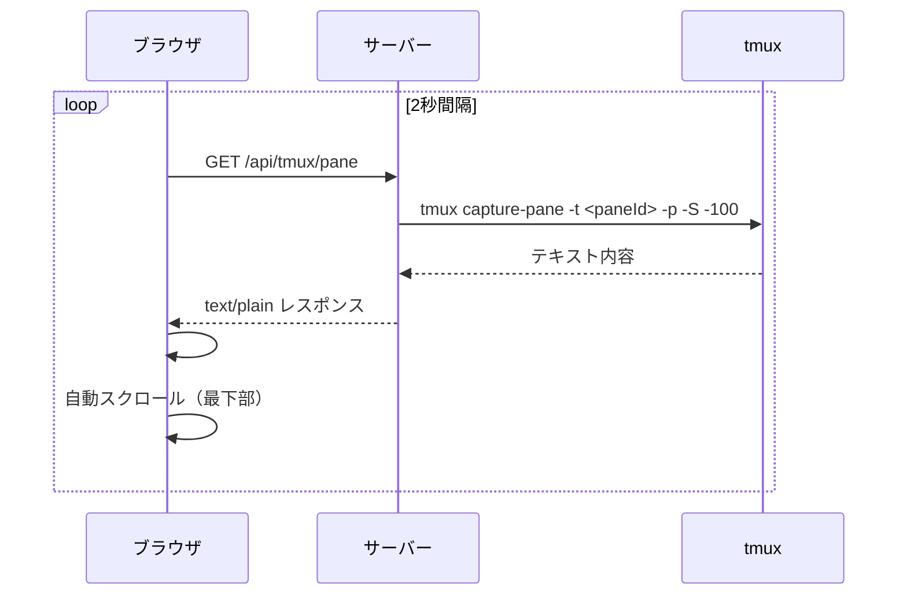
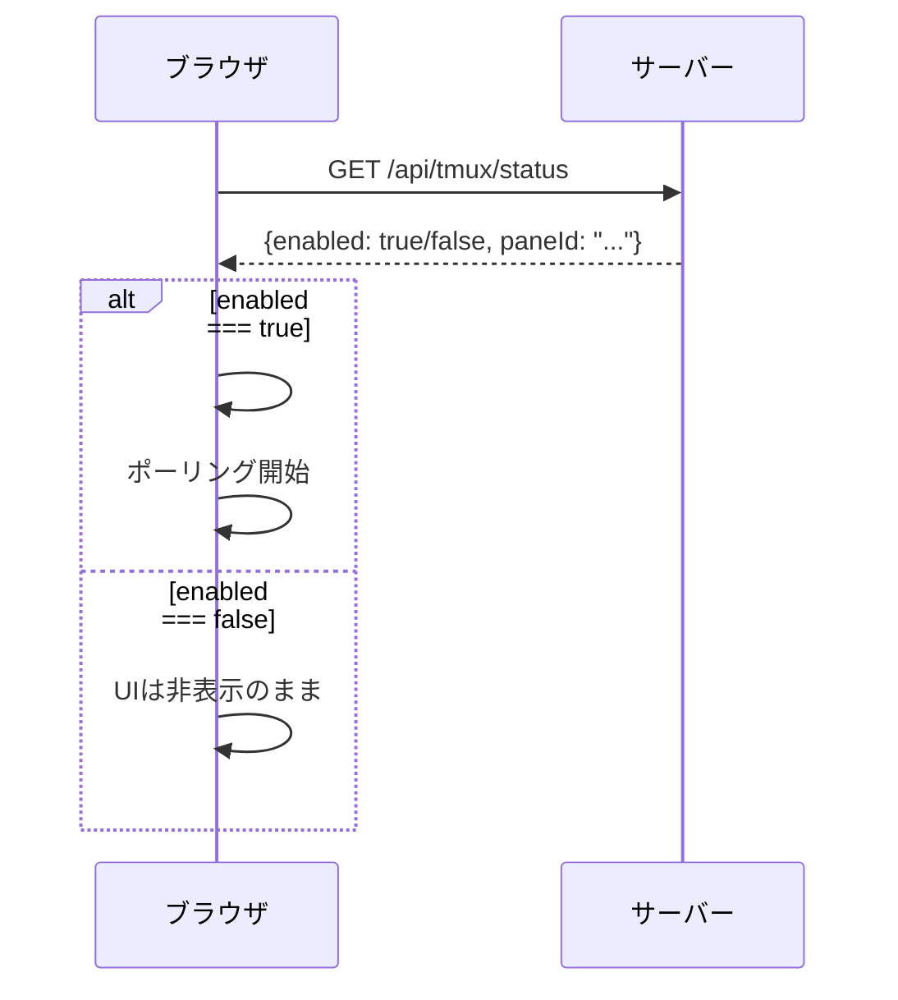
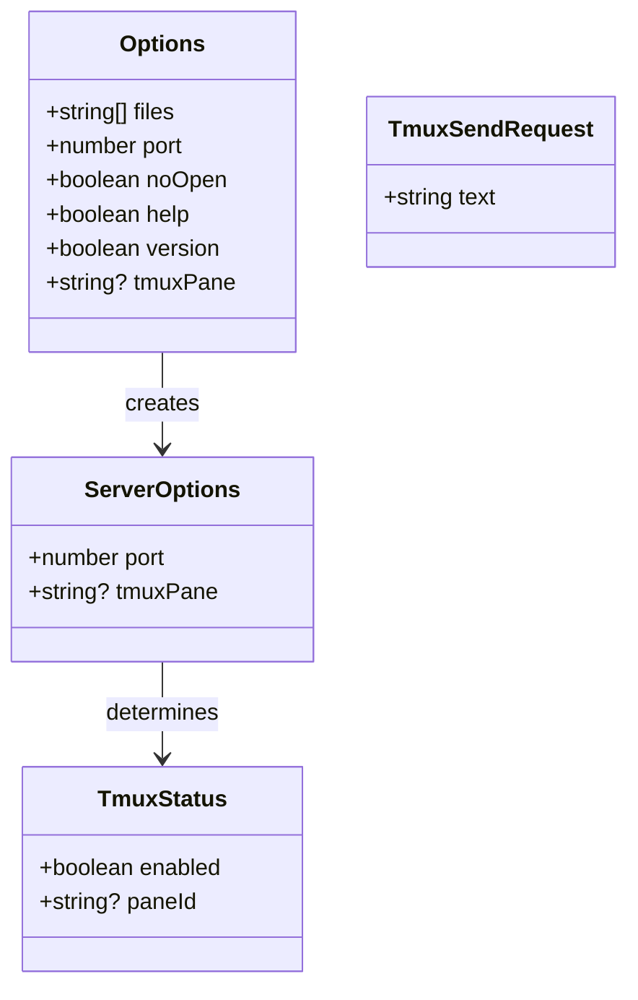

# tmuxキャッチアップUI 設計

関連: [requirements](requirements.md)

## 概要
**目的**: この機能はClaude Codeユーザーに、ブラウザ上のマークダウンプレビューからtmux上のClaude Codeへ直接質問を送信し、応答を確認できる価値を提供します。
**ユーザー**: Claude Codeをtmux環境で使用する開発者が、仕様書レビュー中に疑問点を即座にClaude Codeへフィードバックするためにこれを利用します。
**影響**: CLI引数解析、HTTPサーバーAPI、フロントエンドUIへの拡張を行います。

## ゴール
- ブラウザUIからtmux上のClaude Codeにテキスト入力を送信できる
- Claude Codeペインの出力内容をブラウザ上でプレーンテキストとして閲覧できる
- tmux環境以外では一切の影響がない（オプトイン方式）

## 非ゴール
- ANSIカラーコードの再現（プレーンテキスト表示のみ）
- xterm.jsなどの本格的なターミナルエミュレーション
- WebSocketによるリアルタイム通信（HTTPポーリング方式で十分）
- tmuxセッションやウィンドウの管理操作
- 認証や権限管理（ローカル環境での使用を前提）

## アーキテクチャ

### アーキテクチャパターンと境界マップ



**アーキテクチャ統合**:
- 選択されたパターン: 既存HTTPサーバーにAPIエンドポイントを追加し、child_process.execSyncでtmuxコマンドを実行する
- ドメイン/機能境界: CLIはtmuxペイン情報の受け渡し、Serverはtmuxコマンド実行のプロキシ、Clientはキャッチアップ操作UI
- 保持される既存パターン: HTTPサーバー、静的ファイル配信、CLIオプション解析
- 新規コンポーネントの根拠: tmuxヘルパー関数（コマンド実行の安全な抽象化）、キャッチアップパネル（専用UI）

### 技術スタック

| レイヤー | 選択/バージョン | 機能における役割 | 備考 |
|--------|---------------|----------------|-----|
| CLIオプション | util.parseArgs | --tmux-paneオプション解析 | 既存の仕組みに追加 |
| tmux連携 | child_process.execSync | tmuxコマンド実行 | Node.js標準API、外部依存なし |
| HTTPサーバー | http標準モジュール | tmux APIエンドポイント | 既存サーバーに追加 |
| フロントエンド | vanilla JS | キャッチアップパネルUI | 追加ライブラリなし |

## システムフロー

### 質問送信フロー



### ペイン内容取得フロー（ポーリング）



### 初期化フロー



## 要件トレーサビリティ

| 要件 | 概要 | コンポーネント | インターフェース |
|------|------|--------------|----------------|
| 1.1 | --tmux-paneオプション | index.ts | parseOptions() |
| 1.2 | オプション未指定時のUI非表示 | app.js | initTmuxCatchup() |
| 1.3 | ペイン情報のサーバー受け渡し | index.ts, server.ts | ServerOptions.tmuxPane |
| 2.1 | tmuxステータスAPI | server.ts | GET /api/tmux/status |
| 2.2 | ペイン内容取得API | server.ts | GET /api/tmux/pane |
| 2.3 | テキスト送信API | server.ts | POST /api/tmux/send |
| 2.4-2.6 | 入力サニタイズ・エラー処理 | server.ts | sanitizeTmuxInput(), parseTmuxRequestBody() |
| 3.1 | キャッチアップパネル配置 | index.html, styles.css | .tmux-panel |
| 3.2, 3.15 | テキスト入力・送信UI（IME対応） | index.html, app.js | #tmux-input, #tmux-send, isComposing |
| 3.3 | ペイン出力表示 | app.js | fetchTmuxPaneContent() |
| 3.4 | ポーリング制御 | app.js | startTmuxPolling(), stopTmuxPolling() |
| 3.5 | パネル折りたたみ | styles.css, app.js | .tmux-panel-body.collapsed |
| 3.6 | 自動スクロール | app.js | scrollTop = scrollHeight |

## コンポーネントとインターフェース

### CLIレイヤー

#### src/index.ts（変更）

| フィールド | 詳細 |
|----------|------|
| 意図 | --tmux-pane CLIオプションの追加とサーバーへの受け渡し |
| 要件 | 1.1, 1.3 |

**責任と制約**
- `--tmux-pane <pane_id>` オプションを解析
- ペイン情報をServerOptionsに含めてstartServerに渡す

**依存関係**
- インバウンド: ユーザー入力（CLI引数）
- アウトバウンド: server.ts -- ServerOptions.tmuxPane

**メソッド一覧**

| メソッドシグネチャ | 概要 | パラメータ | 戻り値 |
|------------------|------|----------|-------|
| `parseOptions(args: string[]): Options` | 引数解析（tmuxPane追加） | args: CLI引数 | Options（tmuxPane含む） |

### サーバーレイヤー

#### src/server.ts（変更）

| フィールド | 詳細 |
|----------|------|
| 意図 | tmux APIエンドポイントの提供とtmuxコマンドの安全な実行 |
| 要件 | 2.1-2.6 |

**責任と制約**
- tmux APIエンドポイント3つを提供
- tmuxコマンドをchild_process.execSyncで実行
- 入力のサニタイズとボディサイズ制限

**依存関係**
- インバウンド: index.ts -- ServerOptions.tmuxPane、ブラウザ -- HTTP API
- アウトバウンド: tmuxプロセス -- execSync

**メソッド一覧**

| メソッドシグネチャ | 概要 | パラメータ | 戻り値 |
|------------------|------|----------|-------|
| `sanitizeTmuxInput(text: string): string` | 制御文字除去 | text: ユーザー入力 | サニタイズ済みテキスト |
| `tmuxCapturePaneContent(paneId: string): string` | ペイン内容取得 | paneId: tmuxペインID | ペインのテキスト内容 |
| `tmuxSendKeys(paneId: string, text: string): void` | テキスト送信 | paneId, text | なし |
| `parseTmuxRequestBody(req: IncomingMessage): Promise<string>` | POSTボディ解析 | req: HTTPリクエスト | ボディ文字列 |

### フロントエンドレイヤー

#### public/app.js（変更）

| フィールド | 詳細 |
|----------|------|
| 意図 | キャッチアップパネルのUI制御（初期化、ポーリング、送信、折りたたみ） |
| 要件 | 3.1-3.6 |

**責任と制約**
- /api/tmux/statusの確認とパネル表示/非表示制御
- 2秒間隔のポーリングによるペイン内容取得
- テキスト送信とUI状態管理
- パネル折りたたみ時のポーリング停止

**メソッド一覧**

| メソッドシグネチャ | 概要 | パラメータ | 戻り値 |
|------------------|------|----------|-------|
| `initTmuxCatchup(): Promise<void>` | tmux機能の初期化 | なし | void |
| `setupTmuxEventListeners(): void` | イベントリスナー設定 | なし | void |
| `sendTmuxMessage(): Promise<void>` | テキスト送信 | なし | void |
| `fetchTmuxPaneContent(): Promise<void>` | ペイン内容取得・表示 | なし | void |
| `startTmuxPolling(): void` | ポーリング開始 | なし | void |
| `stopTmuxPolling(): void` | ポーリング停止 | なし | void |

### クラス構造図



## データモデル

### TmuxStatus（APIレスポンス）

| フィールド | 詳細 |
|----------|------|
| 意図 | tmux連携の有効状態をフロントエンドに通知 |
| 要件 | 2.1 |

**フィールド定義**

| フィールド名 | 型 | 説明 |
|------------|---|-----|
| enabled | boolean | tmux連携が有効かどうか |
| paneId | string / null | tmuxペインID（無効時null） |

### TmuxSendRequest（APIリクエスト）

| フィールド | 詳細 |
|----------|------|
| 意図 | ブラウザからClaude Codeへ送信するテキスト |
| 要件 | 2.3 |

**フィールド定義**

| フィールド名 | 型 | 説明 |
|------------|---|-----|
| text | string | 送信するテキスト |

## エラー処理

### エラーカテゴリと対応
- **ユーザーエラー**: textフィールド未指定 -> 400レスポンス
- **システムエラー**: tmuxコマンド実行失敗 -> エラーメッセージ返却（ペイン取得時）/ 500レスポンス（送信時）
- **設定エラー**: tmux-pane未指定でtmux APIアクセス -> 404レスポンス

## コーディングパターン

### tmuxコマンド実行パターン
```typescript
import { execSync } from "child_process";

// ペイン内容取得
function tmuxCapturePaneContent(paneId: string): string {
  try {
    return execSync(
      `tmux capture-pane -t ${JSON.stringify(paneId)} -p -S -100`,
      { encoding: "utf-8", timeout: 5000 }
    );
  } catch {
    return "[Error: Failed to capture tmux pane content]";
  }
}
```

### 入力サニタイズパターン
```typescript
// 制御文字（タブ・改行以外）を除去
function sanitizeTmuxInput(text: string): string {
  return text.replace(/[\x00-\x08\x0b\x0c\x0e-\x1f]/g, "");
}
```

### POSTリクエストボディ解析パターン
```typescript
function parseTmuxRequestBody(req: http.IncomingMessage): Promise<string> {
  return new Promise((resolve, reject) => {
    let body = "";
    req.on("data", (chunk: Buffer) => {
      body += chunk.toString();
      if (body.length > 10240) reject(new Error("Request body too large"));
    });
    req.on("end", () => resolve(body));
    req.on("error", reject);
  });
}
```

## テスト戦略

### テスト種類の選定

| 対象 | テスト種類 | 理由 |
|-----|----------|-----|
| parseOptions(tmux-pane) | ユニットテスト | 純粋な引数解析のため |
| GET /api/tmux/status | 統合テスト | APIレスポンスの確認 |
| tmux無効時の404 | 統合テスト | エラーハンドリングの確認 |
| capture-pane/send-keys | 手動テスト | 実際のtmux環境が必要 |

### ユニットテスト
- parseOptions: --tmux-paneオプションの解析を検証
- parseOptions: --tmux-pane未指定時のundefinedを検証

### 統合テスト
- GET /api/tmux/status: tmux有効時のレスポンス確認
- GET /api/tmux/status: tmux無効時のレスポンス確認
- GET /api/tmux/pane: tmux無効時の404確認
- POST /api/tmux/send: tmux無効時の404確認

### 手動確認項目
- tmux環境でmd-open --tmux-pane起動時にキャッチアップパネルが表示される
- テキスト入力がClaude Codeペインに送信される
- ペインの出力がブラウザに表示される
- パネル折りたたみ時にポーリングが停止する
- tmux-pane未指定時にパネルが表示されない

## 影響範囲

| 影響を受ける機能 | 影響の内容 | 影響レベル | 軽減策 |
|----------------|----------|----------|-------|
| マークダウンプレビュー | .contentにflex-direction: column追加 | 中 | .markdown-bodyにflex: 1とoverflow-y: auto追加で従来表示を維持 |
| CLIオプション解析 | --tmux-paneオプション追加 | 低 | 既存オプションに影響しない追加のみ |
| HTTPサーバー | /api/tmux/* エンドポイント追加 | 低 | 既存エンドポイントに影響しない追加のみ |

## 注意事項

| カテゴリ | 注意点 | 詳細説明 | 防止策 |
|--------|-------|---------|-------|
| セキュリティ | コマンドインジェクション | tmux send-keysに渡すテキストの安全性 | JSON.stringifyでクォート、制御文字除去 |
| セキュリティ | XSS | capture-pane出力のブラウザ表示 | textContent使用（innerHTML不使用） |
| セキュリティ | DoS | 大きなリクエストボディ | 10KBサイズ制限 |
| パフォーマンス | ポーリング負荷 | 2秒間隔のHTTPリクエスト | パネル折りたたみ時はポーリング停止 |
| パフォーマンス | execSyncブロッキング | tmuxコマンド実行中のイベントループブロック | 5秒タイムアウト設定（tmuxコマンドは通常ミリ秒単位で完了） |
| 互換性 | tmux未インストール環境 | tmuxコマンドが見つからない場合のエラー | --tmux-paneオプション未指定時は一切のtmux操作を行わない |
| テスト | CI環境でのtmux不在 | tmuxがインストールされていないCI環境 | tmux依存テストはステータスAPIと404レスポンスのみ |
