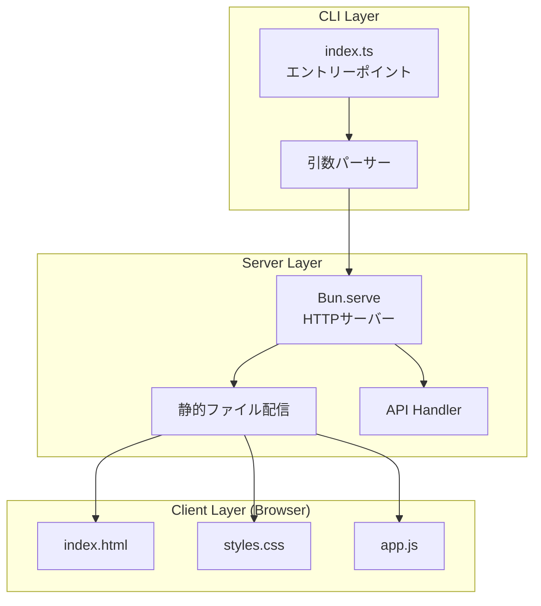
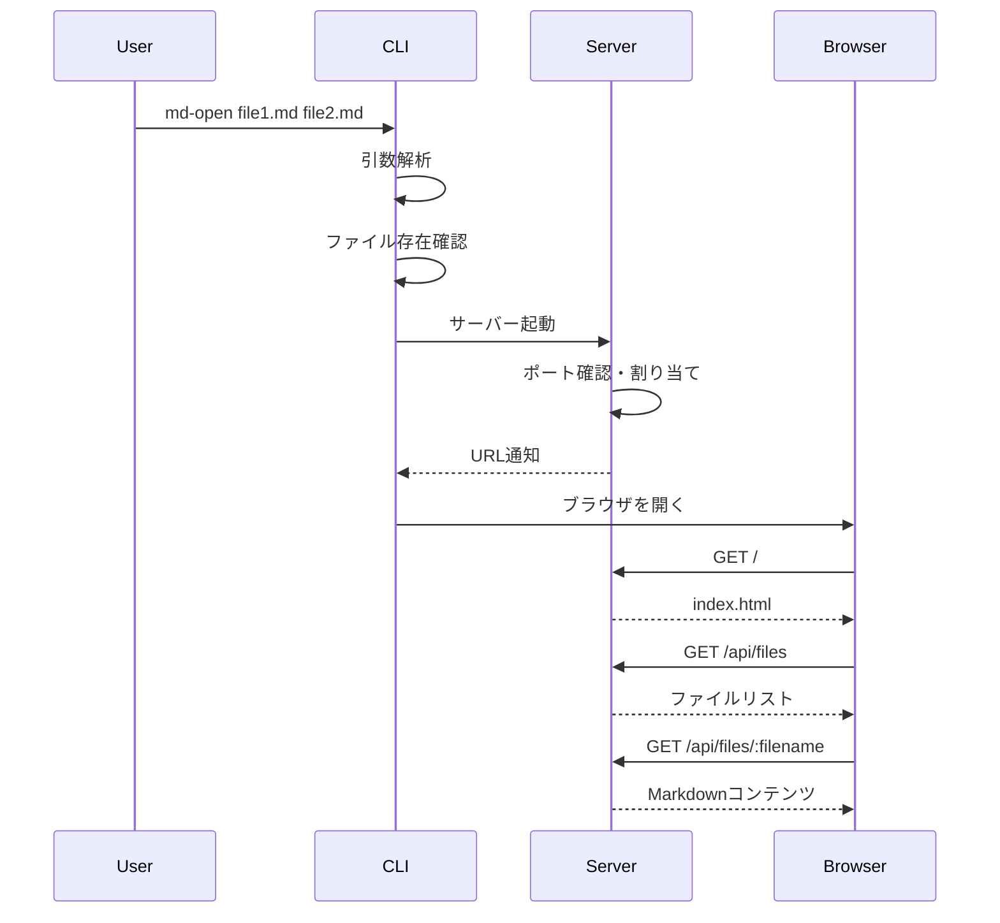
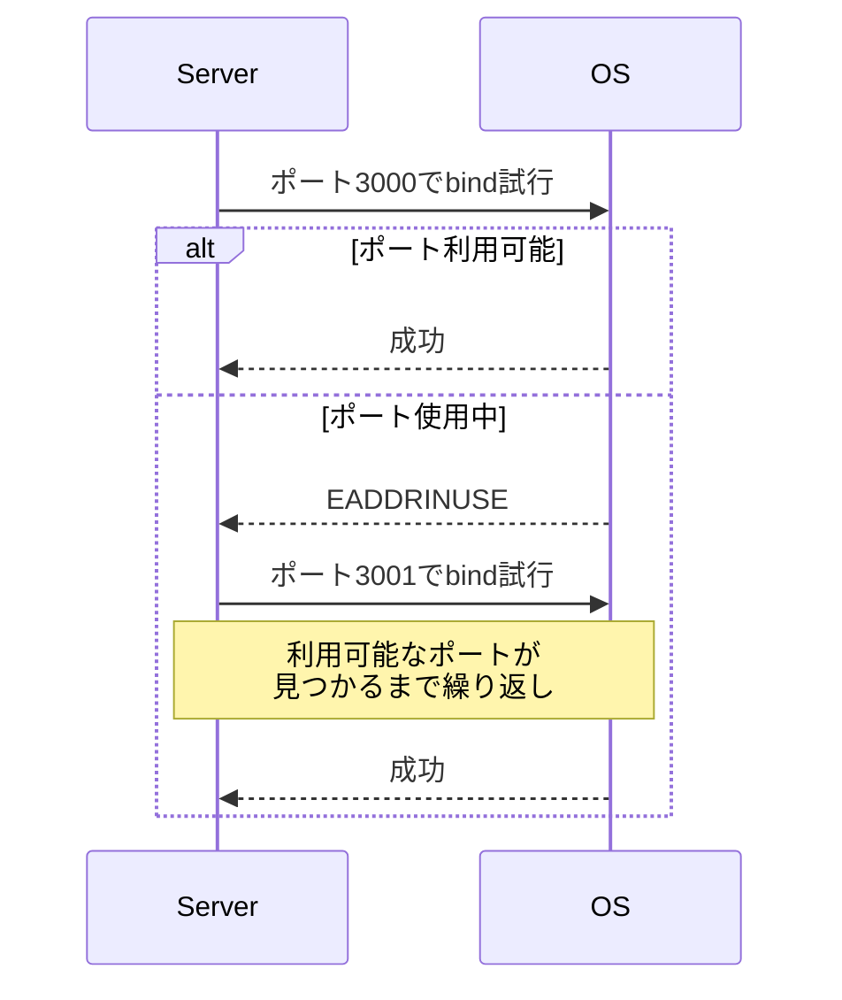
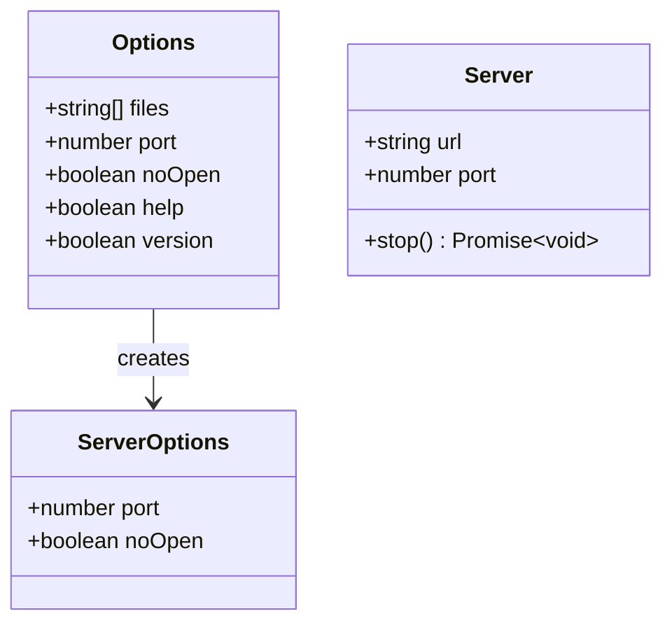

# md-open CLI 設計

関連: [requirements](requirements.md)

## 概要
**目的**: この機能はターミナルユーザーに、マークダウンファイルを素早くブラウザでプレビューする価値を提供します。
**ユーザー**: 開発者やドキュメント作成者が、マークダウンの最終表示確認のためにこれを利用します。
**影響**: 新規CLIツールの作成であり、既存システムへの影響はありません。

## ゴール
- シンプルなコマンドで複数のマークダウンファイルをプレビュー
- ポート競合時の自動解決
- npxで実行可能

## 非ゴール
- ファイル監視（ホットリロード）機能
- マークダウンの編集機能
- PDF出力機能

## アーキテクチャ

### アーキテクチャパターンと境界マップ



**アーキテクチャ統合**:
- 選択されたパターン: シンプルな3層構造（CLI → Server → Client）
- ドメイン/機能境界: CLIは引数解析と起動、Serverはファイル配信とAPI、Clientはレンダリング
- 新規コンポーネントの根拠: 新規プロジェクトのため全て新規作成

### 技術スタック

| レイヤー | 選択/バージョン | 機能における役割 | 備考 |
|--------|---------------|----------------|-----|
| Runtime | Bun | CLIとサーバー実行 | 高速、TypeScript直接実行 |
| CLI | util.parseArgs | 引数解析 | Node.js標準API、Bun互換 |
| Server | Bun.serve | HTTPサーバー | 静的ファイル配信、API |
| Test | bun:test | ユニットテスト | Bunネイティブ |

## システムフロー

### コマンド実行フロー



### ポート競合解決フロー



## 要件トレーサビリティ

| 要件 | 概要 | コンポーネント | インターフェース |
|------|------|--------------|----------------|
| 1.1-1.4 | CLI引数処理 | index.ts | parseArgs |
| 1.5-1.6 | CLIオプション | index.ts | Options型 |
| 1.7-1.8 | ファイル検証 | index.ts | validateFiles |
| 2.1-2.2 | サーバー起動 | server.ts | startServer |
| 2.3-2.4 | 起動通知 | server.ts | onListen |
| 3.1-3.5 | ファイルリスト | client/app.js | FileList |
| 4.1-4.3 | API | server.ts | handleAPI |

## コンポーネントとインターフェース

### CLI

#### index.ts (エントリーポイント)

| フィールド | 詳細 |
|----------|------|
| 意図 | CLIのエントリーポイント。引数解析とサーバー起動を担当 |
| 要件 | 1.1-1.8 |

**責任と制約**
- コマンドライン引数の解析
- ファイルの存在確認
- サーバーの起動と終了処理

**依存関係**
- アウトバウンド: server.ts — サーバー起動

**メソッド一覧**

| メソッドシグネチャ | 概要 | パラメータ | 戻り値 |
|------------------|------|----------|-------|
| `main()` | メイン処理 | なし | void |
| `parseOptions(args: string[]): Options` | 引数解析 | args: コマンドライン引数 | Options |
| `validateFiles(files: string[]): string[]` | ファイル検証 | files: ファイルパス配列 | 有効なファイルパス配列 |

### Server

#### server.ts

| フィールド | 詳細 |
|----------|------|
| 意図 | HTTPサーバーの起動と管理、API・静的ファイル配信 |
| 要件 | 2.1-2.6, 4.1-4.3 |

**責任と制約**
- HTTPサーバーのライフサイクル管理
- ポート競合時の自動解決
- 静的ファイル配信
- APIエンドポイント提供

**依存関係**
- インバウンド: index.ts — サーバー起動要求
- アウトバウンド: ファイルシステム — ファイル読み取り

**メソッド一覧**

| メソッドシグネチャ | 概要 | パラメータ | 戻り値 |
|------------------|------|----------|-------|
| `startServer(files: string[], options: ServerOptions): Promise<Server>` | サーバー起動 | files: ファイルリスト, options: 設定 | Server |
| `startServerWithFallback(files: string[], port: number, options: ServerOptions): Promise<Server>` | ポートフォールバック付き起動 | files, port, options | Server |
| `handleRequest(req: Request, files: string[]): Response` | リクエストハンドリング | req, files | Response |

### クラス構造図



## データモデル

### FileInfo

| フィールド | 詳細 |
|----------|------|
| 意図 | ファイル情報をAPIで返却するための型 |
| 要件 | 4.1 |

**フィールド定義**

| フィールド名 | 型 | 説明 |
|------------|---|-----|
| name | string | ファイル名（basename） |
| path | string | ファイルパス（相対または絶対） |

## エラー処理

### エラーカテゴリと対応
- **ユーザーエラー**: 存在しないファイル指定 → 警告表示して続行
- **システムエラー**: ポートバインド失敗 → 次のポートでリトライ
- **ビジネスロジックエラー**: 全ファイル無効 → エラーメッセージ表示して終了

## ライブラリ使用仕様

### Bun.serve

| API | シグネチャ | 使用例 | 既存使用箇所 |
|-----|----------|-------|------------|
| serve | `Bun.serve(options: ServeOptions): Server` | `Bun.serve({ port: 3000, fetch: handler })` | server.ts |

### util.parseArgs

| API | シグネチャ | 使用例 | 既存使用箇所 |
|-----|----------|-------|------------|
| parseArgs | `parseArgs(config: ParseArgsConfig)` | `parseArgs({ args: Bun.argv.slice(2), options: {...} })` | index.ts |

## コーディングパターン

### ポートフォールバックパターン
```typescript
async function startServerWithFallback(
  files: string[],
  port: number,
  options: ServerOptions
): Promise<Server> {
  try {
    return await startServer(files, { ...options, port });
  } catch (error) {
    if (error.code === "EADDRINUSE") {
      console.log(`Port ${port} is busy, trying ${port + 1}...`);
      return startServerWithFallback(files, port + 1, options);
    }
    throw error;
  }
}
```

### 静的ファイル配信パターン
```typescript
function serveStatic(path: string): Response {
  const file = Bun.file(`./public${path}`);
  return new Response(file);
}
```

## テスト戦略

### テスト種類の選定

| 対象 | テスト種類 | 理由 |
|-----|----------|-----|
| parseOptions | ユニットテスト | 純粋な関数のため |
| validateFiles | ユニットテスト | ファイルシステムモック可能 |
| startServer | 統合テスト | サーバー起動の実際の動作確認 |
| API endpoints | 統合テスト | HTTPリクエスト/レスポンスの確認 |

### ユニットテスト
- parseOptions: 各オプションの解析を検証
- validateFiles: 存在するファイル/存在しないファイルの処理を検証

### 統合テスト
- サーバー起動とポートフォールバックの動作確認
- APIエンドポイントのレスポンス確認

## 影響範囲

| 影響を受ける機能 | 影響の内容 | 影響レベル | 軽減策 |
|----------------|----------|----------|-------|
| なし | 新規プロジェクト | - | - |

## 注意事項

| カテゴリ | 注意点 | 詳細説明 | 防止策 |
|--------|-------|---------|-------|
| セキュリティ | ファイルパス検証 | 任意ファイルアクセス防止 | 許可されたファイルのみ配信 |
| パフォーマンス | 大きなMDファイル | メモリ使用量増加 | ファイルサイズ警告 |
