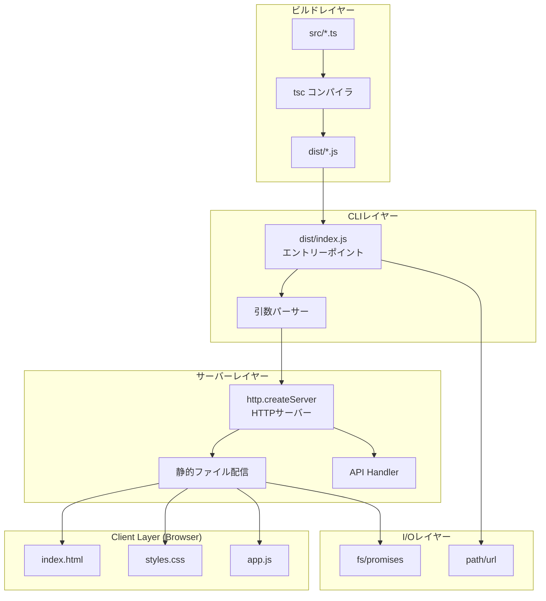
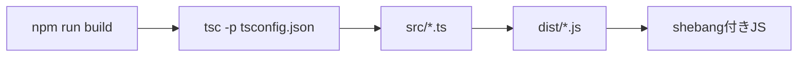
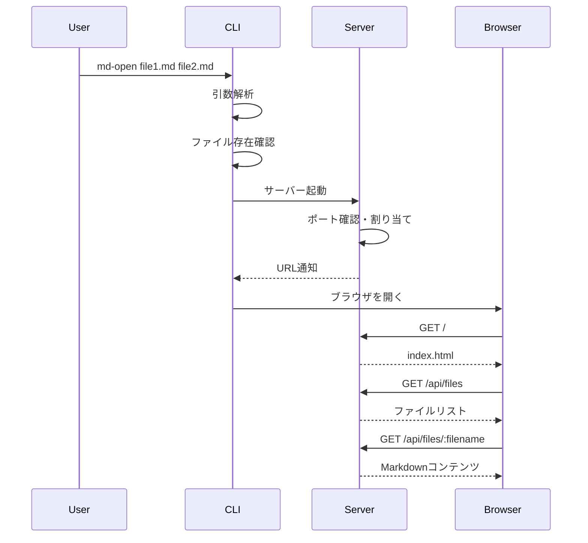
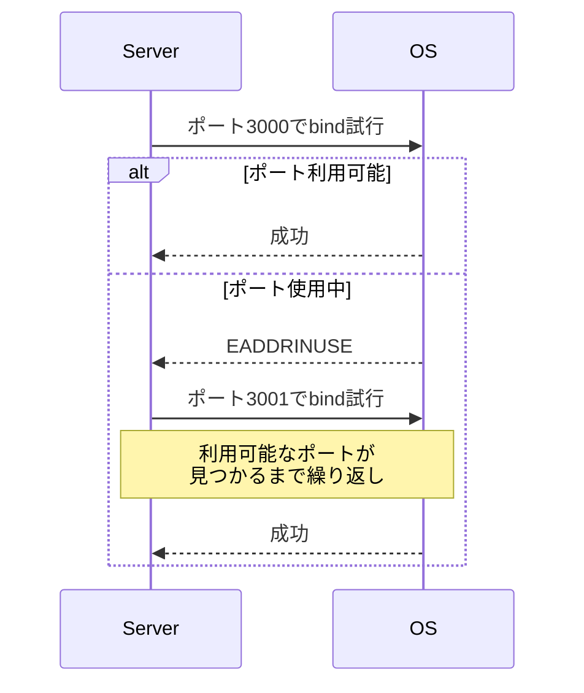
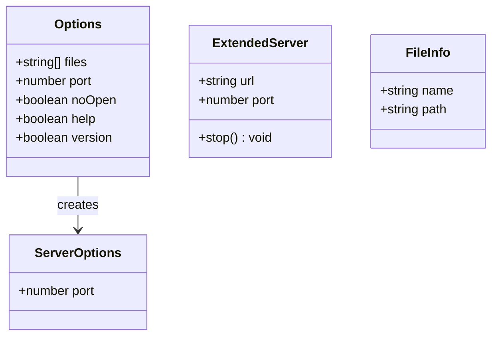

# md-open CLI 設計

関連: [requirements](requirements.md)

## 概要
**目的**: この機能はターミナルユーザーに、マークダウンファイルを素早くブラウザでプレビューする価値を提供します。
**ユーザー**: 開発者やドキュメント作成者が、マークダウンの最終表示確認のためにこれを利用します。
**影響**: 新規CLIツールの作成であり、既存システムへの影響はありません。

## ゴール
- シンプルなコマンドで複数のマークダウンファイルをプレビュー
- ポート競合時の自動解決
- npxで実行可能
- 外部依存を最小化する（Node.js標準APIを優先）

## 非ゴール
- ファイル監視（ホットリロード）機能
- マークダウンの編集機能
- PDF出力機能

## アーキテクチャ

### アーキテクチャパターンと境界マップ



**アーキテクチャ統合**:
- 選択されたパターン: シンプルな層構造（Build → CLI → Server → Client）
- ドメイン/機能境界: CLIは引数解析と起動、Serverはファイル配信とAPI、Clientはレンダリング
- 保持される既存パターン: HTTPサーバー、静的ファイル配信、CLIオプション解析
- 新規コンポーネントの根拠: tscビルドステップの追加、dist/出力ディレクトリ

### 技術スタック

| レイヤー | 選択/バージョン | 機能における役割 | 備考 |
|--------|---------------|----------------|-----|
| ランタイム | Node.js 20+ | 実行環境 | LTSバージョン |
| ビルド | TypeScript 5.x | TS→JSトランスパイル | tscコンパイラ |
| CLI | util.parseArgs | 引数解析 | Node.js標準API |
| HTTPサーバー | http標準モジュール | リクエスト処理 | 外部依存なし |
| ファイルI/O | fs/promises | 非同期ファイル操作 | 外部依存なし |
| 開発時TS実行 | tsx | 開発時のTS直接実行 | devDependency |
| テスト | node:test + node:assert | テスト実行 | 外部依存なし |

## システムフロー

### ビルドフロー



### コマンド実行フロー



### ポート競合解決フロー



## 要件トレーサビリティ

| 要件 | 概要 | コンポーネント | インターフェース |
|------|------|--------------|----------------|
| 1.1-1.4 | CLI引数処理 | index.ts | parseArgs |
| 1.5-1.6 | CLIオプション | index.ts | Options型 |
| 1.7-1.8 | ファイル検証 | index.ts | validateFiles |
| 2.1-2.2 | サーバー起動 | server.ts | startServer |
| 2.3-2.4 | 起動通知 | server.ts | onListen |
| 2.7-2.13 | HTTPサーバー | server.ts | http.createServer |
| 3.1-3.5 | ファイルリスト | client/app.js | FileList |
| 4.1-4.8 | ランタイム・ビルド | tsconfig.json, package.json | tsc, npm scripts |
| 5.1-5.3 | ファイルI/O | server.ts | fs.promises |
| 6.1-6.5 | package.json | package.json | npm設定 |
| 7.1-7.3 | テスト | *.test.ts | node:test |

## コンポーネントとインターフェース

### tsconfig.json

| フィールド | 詳細 |
|----------|------|
| 意図 | tscビルド設定でESM出力を生成 |
| 要件 | 4.4, 4.5, 4.8 |

**設定内容**
```json
{
  "compilerOptions": {
    "target": "ES2022",
    "module": "ES2022",
    "moduleResolution": "node",
    "outDir": "dist",
    "rootDir": "src",
    "strict": true,
    "skipLibCheck": true,
    "declaration": false,
    "sourceMap": false,
    "esModuleInterop": true,
    "types": ["node"]
  },
  "include": ["src/**/*.ts"],
  "exclude": ["node_modules", "**/*.test.ts"]
}
```

### src/index.ts (エントリーポイント)

| フィールド | 詳細 |
|----------|------|
| 意図 | CLIのエントリーポイント。引数解析とサーバー起動を担当 |
| 要件 | 1.1-1.8, 4.2 |

**責任と制約**
- コマンドライン引数の解析
- ファイルの存在確認
- サーバーの起動と終了処理
- SIGINT処理

**依存関係**
- インバウンド: ユーザー入力
- アウトバウンド: server.ts — サーバー起動

**メソッド一覧**

| メソッドシグネチャ | 概要 | パラメータ | 戻り値 |
|------------------|------|----------|-------|
| `main()` | メイン処理 | なし | void |
| `parseOptions(args: string[]): Options` | 引数解析 | args: コマンドライン引数 | Options |
| `validateFiles(files: string[]): string[]` | ファイル検証 | files: ファイルパス配列 | 有効なファイルパス配列 |
| `showHelp(): void` | ヘルプ表示 | なし | void |
| `showVersion(): void` | バージョン表示 | なし | void |

### src/server.ts

| フィールド | 詳細 |
|----------|------|
| 意図 | HTTPサーバーの起動と管理、API・静的ファイル配信 |
| 要件 | 2.1-2.13, 5.1-5.3 |

**責任と制約**
- HTTPサーバーのライフサイクル管理
- ポート競合時の自動解決
- 静的ファイル配信
- APIエンドポイント提供

**依存関係**
- インバウンド: index.ts — サーバー起動要求
- アウトバウンド: fs/promises — ファイル読み取り

**メソッド一覧**

| メソッドシグネチャ | 概要 | パラメータ | 戻り値 |
|------------------|------|----------|-------|
| `startServer(files: string[], options: ServerOptions): Promise<Server>` | サーバー起動 | files: ファイルリスト, options: 設定 | Server |
| `startServerWithFallback(files: string[], port: number, options: ServerOptions, maxRetries: number): Promise<Server>` | ポートフォールバック付き起動 | files, port, options, maxRetries | Server |
| `getContentType(filePath: string): string` | Content-Type判定 | filePath: ファイルパス | MIMEタイプ文字列 |

### クラス構造図



## データモデル

### FileInfo

| フィールド | 詳細 |
|----------|------|
| 意図 | ファイル情報をAPIで返却するための型 |
| 要件 | 2.8 |

**フィールド定義**

| フィールド名 | 型 | 説明 |
|------------|---|-----|
| name | string | ファイル名（basename） |
| path | string | ファイルパス（相対または絶対） |

## エラー処理

### エラーカテゴリと対応
- **ユーザーエラー**: 存在しないファイル指定 → 警告表示して続行
- **システムエラー**: ポートバインド失敗 → 次のポートでリトライ
- **ビジネスロジックエラー**: 全ファイル無効 → エラーメッセージ表示して終了

## ライブラリ使用仕様

### http標準モジュール

| API | シグネチャ | 使用例 | 既存使用箇所 |
|-----|----------|-------|------------|
| createServer | `createServer(handler): Server` | `http.createServer((req, res) => {})` | src/server.ts |
| server.listen | `listen(port, callback): void` | `server.listen(3000, () => {})` | src/server.ts |
| server.close | `close(callback): void` | `server.close(() => {})` | src/server.ts |

### fs/promises

| API | シグネチャ | 使用例 | 既存使用箇所 |
|-----|----------|-------|------------|
| readFile | `readFile(path, encoding): Promise<string>` | `await fs.readFile(path, 'utf-8')` | src/server.ts |
| stat | `stat(path): Promise<Stats>` | `await fs.stat(path)` | src/server.ts |

### url/path

| API | シグネチャ | 使用例 | 既存使用箇所 |
|-----|----------|-------|------------|
| fileURLToPath | `fileURLToPath(url): string` | `fileURLToPath(import.meta.url)` | src/server.ts |
| dirname | `dirname(path): string` | `dirname(__filename)` | src/server.ts |

### util.parseArgs

| API | シグネチャ | 使用例 | 既存使用箇所 |
|-----|----------|-------|------------|
| parseArgs | `parseArgs(config: ParseArgsConfig)` | `parseArgs({ args: process.argv.slice(2), options: {...} })` | index.ts |

## コーディングパターン

### ディレクトリパス取得パターン（ESM）
```typescript
import { fileURLToPath } from 'url';
import path from 'path';

const __filename = import.meta.url ? fileURLToPath(import.meta.url) : "";
const __dirname = __filename ? path.dirname(__filename) : process.cwd() + "/src";
```

**注意**: pathモジュールはdestructuring（`import { dirname } from 'path'`）ではなく、default import（`import path from 'path'`）を使用すること。`node --import tsx`環境でdestructuringを使用すると、関数が`undefined`になる問題がある。

### HTTPレスポンスパターン
```typescript
// JSON応答
res.statusCode = 200;
res.setHeader('Content-Type', 'application/json; charset=utf-8');
res.end(JSON.stringify(data));

// ファイル応答
res.statusCode = 200;
res.setHeader('Content-Type', getContentType(filePath));
res.end(content);

// エラー応答
res.statusCode = 404;
res.end('Not Found');
```

### ポートフォールバックパターン
```typescript
const server = http.createServer(handler);

server.on('error', (error: NodeJS.ErrnoException) => {
  if (error.code === 'EADDRINUSE' && retries > 0) {
    console.log(`Port ${port} is busy, trying ${port + 1}...`);
    startServerWithFallback(files, port + 1, options, retries - 1);
  } else {
    throw error;
  }
});

server.listen(port);
```

### 静的ファイル配信パターン
```typescript
function serveStatic(path: string): Response {
  const staticPath = path.resolve(__dirname, "../public", pathname.slice(1));
  const content = await fs.readFile(staticPath);
  return content;
}
```

## テスト戦略

### テスト種類の選定

| 対象 | テスト種類 | 理由 |
|-----|----------|-----|
| parseOptions | ユニットテスト | 純粋な引数解析関数のため |
| validateFiles | ユニットテスト | ファイルシステムモック可能 |
| startServer | 統合テスト | サーバー起動の実際の動作確認 |
| API endpoints | 統合テスト | HTTPリクエスト/レスポンスの確認 |

### ユニットテスト
- parseOptions: 各オプションの解析を検証
- validateFiles: 存在するファイル/存在しないファイルの処理を検証

### 統合テスト
- サーバー起動とポートフォールバックの動作確認
- APIエンドポイントのレスポンス確認

## 影響範囲

| 影響を受ける機能 | 影響の内容 | 影響レベル | 軽減策 |
|----------------|----------|----------|-------|
| なし | 新規プロジェクト | - | - |

## 注意事項

| カテゴリ | 注意点 | 詳細説明 | 防止策 |
|--------|-------|---------|-------|
| セキュリティ | ファイルパス検証 | 任意ファイルアクセス防止 | 許可されたファイルのみ配信 |
| パフォーマンス | 大きなMDファイル | メモリ使用量増加 | ファイルサイズ警告 |
| 互換性 | ESMの維持 | type: "module"を維持する | package.json確認 |
| パス解決 | import.meta.dir | Node.jsにはないBun拡張 | fileURLToPath使用 |
| Content-Type | 拡張子判定 | 手動でContent-Type判定が必要 | getContentType関数実装 |
| pathモジュール | destructuring不可 | `node --import tsx`環境でdestructuringすると関数がundefinedになる | default importで`import path from 'path'`を使用 |
| shebang | ビルド後の保持 | tscはshebangを保持する | src/index.tsの先頭にshebang記述 |
| テスト除外 | ビルド対象外 | テストファイルはdistに含めない | tsconfig.jsonのexclude設定 |
