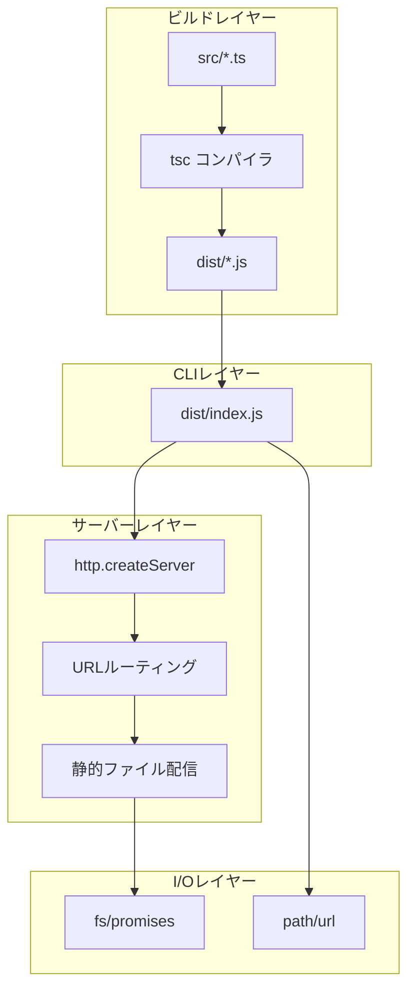
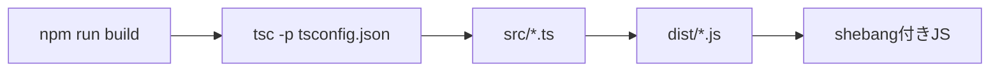
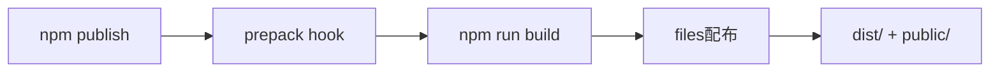
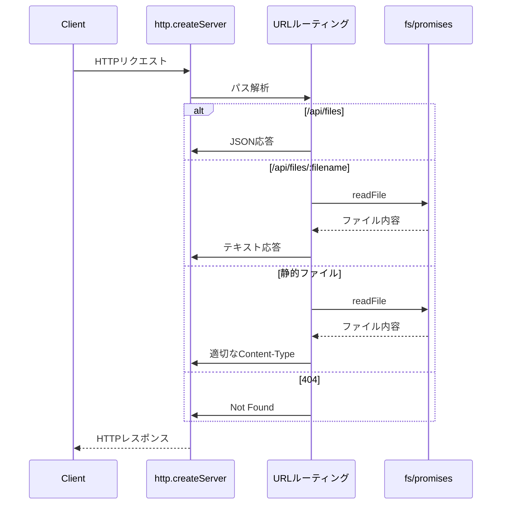
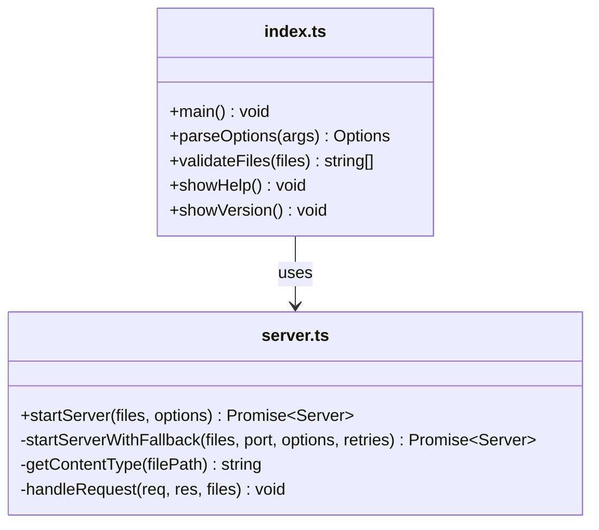

# npm publish対応 設計

関連: [requirements](requirements.md)

## 概要
**目的**: この機能はWeb開発者にnpxで即座に利用可能なマークダウンプレビューツールを提供します。
**ユーザー**: 一般のWeb開発者がドキュメント確認のワークフローのためにこれを利用します。
**影響**: BunランタイムからNode.jsランタイムへの移行、およびビルド方式の変更によって現在の実行環境を変更します。

## ゴール
- npx md-open で即座に利用可能にする
- 外部依存を最小化する（Node.js標準APIを優先）
- 既存のCLIインターフェースを維持する
- TypeScriptランタイム不要でnpxから実行可能にする

## 非ゴール
- Bunランタイムのサポート継続
- 新機能の追加
- パフォーマンス最適化

## アーキテクチャ

### アーキテクチャパターンと境界マップ



**アーキテクチャ統合**:
- 選択されたパターン: ビルド済みJavaScript配布（LaunchUnityCommand方式）
- ドメイン/機能境界: Build → CLI → Server → I/O の単方向依存
- 保持される既存パターン: HTTPサーバー、静的ファイル配信、CLIオプション解析
- 新規コンポーネントの根拠: tscビルドステップの追加、dist/出力ディレクトリ

### 技術スタック

| レイヤー | 選択/バージョン | 機能における役割 | 備考 |
|--------|---------------|----------------|-----|
| ランタイム | Node.js 20+ | 実行環境 | LTSバージョン |
| ビルド | TypeScript 5.x | TS→JSトランスパイル | tscコンパイラ |
| HTTPサーバー | http標準モジュール | リクエスト処理 | 外部依存なし |
| ファイルI/O | fs/promises | 非同期ファイル操作 | 外部依存なし |
| 開発時TS実行 | tsx | 開発時のTS直接実行 | devDependency |
| テスト | node:test + node:assert | テスト実行 | 外部依存なし |

## システムフロー

### ビルドフロー



### npm publishフロー



### HTTPリクエスト処理フロー



## 要件トレーサビリティ

| 要件 | 概要 | コンポーネント | インターフェース |
|------|------|--------------|----------------|
| 1.1-1.4 | ランタイム移行 | src/index.ts, src/server.ts | shebang, process.argv |
| 2.1-2.8 | HTTPサーバー | src/server.ts | http.createServer |
| 3.1-3.3 | ファイルI/O | src/server.ts | fs.promises |
| 4.1-4.6 | ビルドとnpx実行 | tsconfig.json, package.json | tsc, npm scripts |
| 5.1-5.4 | テスト移行 | *.test.ts | node:test |
| 6.1-6.5 | package.json | package.json | npm設定 |
| 7.1-7.4 | 後方互換性 | src/index.ts | CLIオプション |
| 8.1-8.3 | ドキュメント更新 | CLAUDE.md, README.md | - |

## コンポーネントとインターフェース

### tsconfig.json

| フィールド | 詳細 |
|----------|------|
| 意図 | tscビルド設定でESM出力を生成 |
| 要件 | 4.1, 4.2, 4.6 |

**設定内容**
```json
{
  "compilerOptions": {
    "target": "ES2022",
    "module": "ES2022",
    "moduleResolution": "node",
    "outDir": "dist",
    "rootDir": "src",
    "strict": true,
    "skipLibCheck": true,
    "declaration": false,
    "sourceMap": false,
    "esModuleInterop": true,
    "types": ["node"]
  },
  "include": ["src/**/*.ts"],
  "exclude": ["node_modules", "**/*.test.ts"]
}
```

### package.json

| フィールド | 詳細 |
|----------|------|
| 意図 | npm publish用のパッケージ設定 |
| 要件 | 6.1-6.5 |

**設定変更**
```json
{
  "name": "md-open",
  "version": "1.0.0",
  "type": "module",
  "main": "dist/index.js",
  "bin": {
    "md-open": "dist/index.js"
  },
  "files": [
    "dist/",
    "public/"
  ],
  "scripts": {
    "build": "tsc",
    "prepack": "npm run build",
    "dev": "npx tsx src/index.ts",
    "test": "node --import tsx --test 'src/**/*.test.ts' 'tests/**/*.test.js'"
  },
  "engines": {
    "node": ">=20.0.0"
  },
  "dependencies": {
    "marked": "^15.0.0",
    "open": "^10.0.0"
  },
  "devDependencies": {
    "@types/node": "^22.0.0",
    "tsx": "^4.0.0",
    "typescript": "^5.0.0"
  }
}
```

### src/server.ts

| フィールド | 詳細 |
|----------|------|
| 意図 | Node.js httpモジュールでHTTPサーバーを提供 |
| 要件 | 2.1-2.8, 3.1-3.3 |

**責任と制約**
- HTTPリクエストのルーティングとレスポンス生成
- 静的ファイル配信とContent-Type判定
- ポート競合時のフォールバック処理

**依存関係**
- インバウンド: src/index.ts — サーバー起動
- アウトバウンド: fs/promises — ファイル読み取り

**メソッド一覧**

| メソッドシグネチャ | 概要 | パラメータ | 戻り値 |
|------------------|------|----------|-------|
| `startServer(files: string[], options: ServerOptions): Promise<http.Server>` | サーバー起動 | files: MDファイルパス, options: ポート等 | http.Server |
| `getContentType(filePath: string): string` | Content-Type判定 | filePath: ファイルパス | MIMEタイプ文字列 |

### src/index.ts

| フィールド | 詳細 |
|----------|------|
| 意図 | CLIエントリーポイントとオプション解析 |
| 要件 | 1.1-1.4, 7.1-7.4 |

**責任と制約**
- コマンドライン引数の解析
- ファイル存在確認とバリデーション
- サーバー起動とブラウザオープン
- SIGINT処理

**依存関係**
- インバウンド: ユーザー入力
- アウトバウンド: src/server.ts — サーバー起動

### クラス構造図



## ライブラリ使用仕様

### http標準モジュール

| API | シグネチャ | 使用例 | 既存使用箇所 |
|-----|----------|-------|------------|
| createServer | `createServer(handler): Server` | `http.createServer((req, res) => {})` | src/server.ts |
| server.listen | `listen(port, callback): void` | `server.listen(3000, () => {})` | src/server.ts |
| server.close | `close(callback): void` | `server.close(() => {})` | src/server.ts |

### fs/promises

| API | シグネチャ | 使用例 | 既存使用箇所 |
|-----|----------|-------|------------|
| readFile | `readFile(path, encoding): Promise<string>` | `await fs.readFile(path, 'utf-8')` | src/server.ts |
| stat | `stat(path): Promise<Stats>` | `await fs.stat(path)` | src/server.ts |

### url/path

| API | シグネチャ | 使用例 | 既存使用箇所 |
|-----|----------|-------|------------|
| fileURLToPath | `fileURLToPath(url): string` | `fileURLToPath(import.meta.url)` | src/server.ts |
| dirname | `dirname(path): string` | `dirname(__filename)` | src/server.ts |

## コーディングパターン

### ディレクトリパス取得パターン（ESM）
```typescript
import { fileURLToPath } from 'url';
import path from 'path';

const __filename = import.meta.url ? fileURLToPath(import.meta.url) : "";
const __dirname = __filename ? path.dirname(__filename) : process.cwd() + "/src";
```

**注意**: pathモジュールはdestructuring（`import { dirname } from 'path'`）ではなく、default import（`import path from 'path'`）を使用すること。`node --import tsx`環境でdestructuringを使用すると、関数が`undefined`になる問題がある。

### HTTPレスポンスパターン
```typescript
// JSON応答
res.statusCode = 200;
res.setHeader('Content-Type', 'application/json; charset=utf-8');
res.end(JSON.stringify(data));

// ファイル応答
res.statusCode = 200;
res.setHeader('Content-Type', getContentType(filePath));
res.end(content);

// エラー応答
res.statusCode = 404;
res.end('Not Found');
```

### ポートフォールバックパターン
```typescript
const server = http.createServer(handler);

server.on('error', (error: NodeJS.ErrnoException) => {
  if (error.code === 'EADDRINUSE' && retries > 0) {
    console.log(`Port ${port} is busy, trying ${port + 1}...`);
    startServerWithFallback(files, port + 1, options, retries - 1);
  } else {
    throw error;
  }
});

server.listen(port);
```

## テスト戦略

### テスト種類の選定

| 対象 | テスト種類 | 理由 |
|-----|----------|-----|
| parseOptions | ユニットテスト | 純粋な引数解析関数のため |
| HTTPサーバー | 統合テスト | 実際のHTTP通信を検証するため |
| fixTaskListNumbering | ユニットテスト | 純粋なHTML変換関数のため |

### ユニットテスト
- parseOptions: 各オプションの解析を検証
- fixTaskListNumbering: HTML変換ロジックを検証

### 統合テスト
- サーバー起動とAPI応答を検証
- ポートフォールバックを検証

## 影響範囲

| 影響を受ける機能 | 影響の内容 | 影響レベル | 軽減策 |
|----------------|----------|----------|-------|
| ビルドプロセス | tsx直接実行 → tscビルド | 高 | prepackフックで自動ビルド |
| package.json | bin, files, scripts変更 | 高 | 段階的な設定変更 |
| tsconfig.json | noEmit解除、outDir追加 | 中 | 最小限の変更 |
| CLAUDE.md | Bun → Node.js更新 | 低 | ドキュメント更新のみ |
| README.md | ビルド手順追加 | 低 | ドキュメント更新のみ |

## 注意事項

| カテゴリ | 注意点 | 詳細説明 | 防止策 |
|--------|-------|---------|-------|
| 互換性 | ESMの維持 | type: "module"を維持する | package.json確認 |
| パス解決 | import.meta.dir | Node.jsにはないBun拡張 | fileURLToPath使用 |
| Content-Type | 拡張子判定 | Bunは自動判定していた | getContentType関数実装 |
| サーバー停止 | Promiseベース | server.stop() → server.close() | コールバック対応 |
| pathモジュール | destructuring不可 | `node --import tsx`環境でdestructuringすると関数がundefinedになる | default importで`import path from 'path'`を使用 |
| shebang | ビルド後の保持 | tscはshebangを保持する | src/index.tsの先頭にshebang記述 |
| テスト除外 | ビルド対象外 | テストファイルはdistに含めない | tsconfig.jsonのexclude設定 |
