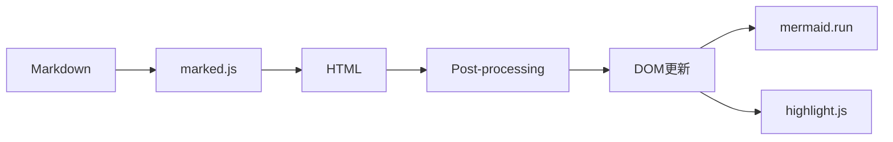
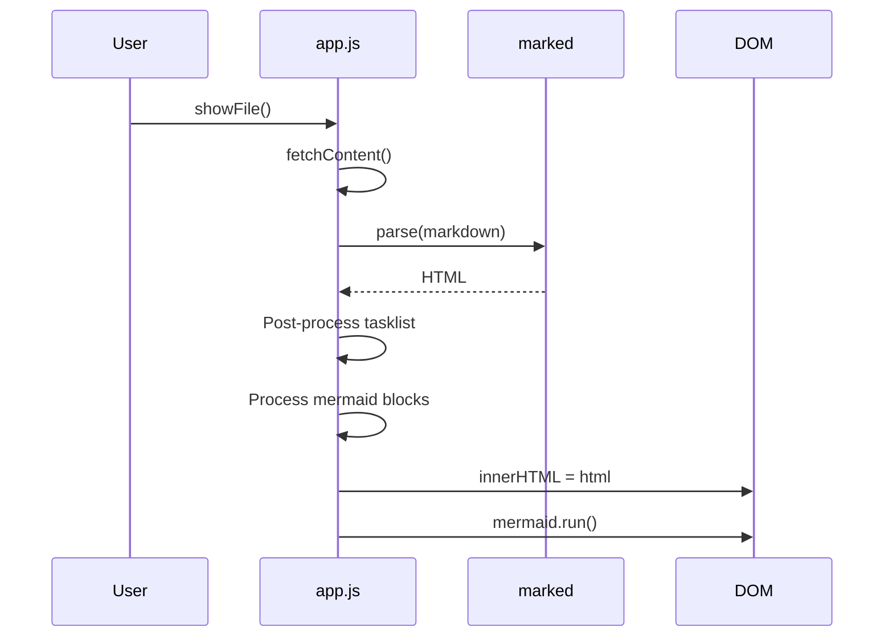

# マークダウンレンダリング 設計

関連: [requirements](requirements.md)

## 概要
**目的**: この機能はユーザーに、マークダウンファイルの美しいプレビューを提供します。
**ユーザー**: ドキュメント作成者が、マークダウンのプレビュー確認のためにこれを利用します。
**影響**: クライアントサイド（public/app.js）でのレンダリング処理です。

## ゴール
- マークダウンからHTMLへの正確な変換
- mermaidダイアグラムのクライアントサイドレンダリング
- コードブロックのシンタックスハイライト
- タスクリスト内の番号付きテキストの正確な表示

## 非ゴール
- サーバーサイドでのマークダウン処理
- サーバーサイドでのmermaidレンダリング
- ライトテーマへの対応

## アーキテクチャ

### レンダリングパイプライン



### 技術スタック

| レイヤー | 選択/バージョン | 機能における役割 | 備考 |
|--------|---------------|----------------|-----|
| Markdown | marked v15.0.0 | マークダウン→HTML変換 | CDN配信 |
| Syntax | highlight.js v11.9.0 | コードハイライト | CDN配信 |
| Diagram | mermaid v11.4.0 | ダイアグラム描画 | クライアントサイドレンダリング |

## 要件トレーサビリティ

| 要件 | 概要 | コンポーネント | インターフェース |
|------|------|--------------|----------------|
| 1.1-1.3 | マークダウン変換 | app.js | marked.parse() |
| 2.1-2.5 | タスクリスト修正 | app.js | fixTaskListNumbering() |
| 3.1-3.6 | シンタックスハイライト | app.js | marked.use() + hljs |
| 4.1-4.5 | Mermaidダイアグラム | app.js | mermaid.run() |

## コンポーネントとインターフェース

### app.js

| フィールド | 詳細 |
|----------|------|
| 意図 | マークダウンレンダリングとPost-processing |
| 要件 | 1.1-1.3, 2.1-2.5, 3.1-3.6, 4.1-4.5 |

**責任と制約**
- markedの初期化とhighlight.js連携
- タスクリストのPost-processing
- mermaidダイアグラムの処理

**依存関係**
- インバウンド: index.html — スクリプト読み込み
- アウトバウンド: marked, highlight.js, mermaid — ライブラリ呼び出し

**メソッド一覧**

| メソッドシグネチャ | 概要 | パラメータ | 戻り値 |
|------------------|------|----------|-------|
| `init()` | 初期化処理 | なし | void |
| `renderMarkdown(markdown: string)` | マークダウンのレンダリング | markdown: マークダウン文字列 | void |
| `fixTaskListNumbering(html: string)` | タスクリストのPost-processing | html: HTML文字列 | 修正後HTML |

## システムフロー

### レンダリングフロー



## コーディングパターン

### タスクリストのPost-processingパターン
```javascript
function fixTaskListNumbering(html) {
  // タスクリスト内のネストした<ol>を平坦化
  // <input>の直後の<ol>...</ol>を削除し、内容のみ保持
  return html.replace(
    /(<input[^>]*>)\s*<ol[^>]*>\s*<li>([\s\S]*?)<\/li>\s*<\/ol>/g,
    '$1 $2'
  );
}
```

### marked highlight拡張パターン
```javascript
marked.use({
  renderer: {
    code(token) {
      const lang = token.lang || '';
      const code = token.text;

      // mermaidコードブロックはhighlight.jsを適用せず、そのまま返す
      if (lang === 'mermaid') {
        return `<pre><code class="language-mermaid">${code}</code></pre>`;
      }

      let highlighted;
      if (lang && hljs.getLanguage(lang)) {
        highlighted = hljs.highlight(code, { language: lang }).value;
      } else {
        highlighted = hljs.highlightAuto(code).value;
      }

      // hljsクラスを付与してCSSでスタイリング可能にする
      const langClass = lang ? `hljs language-${lang}` : 'hljs';
      return `<pre><code class="${langClass}">${highlighted}</code></pre>`;
    }
  }
});
```

### mermaid初期化パターン
```javascript
mermaid.initialize({
  startOnLoad: false,
  theme: 'dark'
});
```

## テスト戦略

### テスト種類の選定

| 対象 | テスト種類 | 理由 |
|-----|----------|-----|
| fixTaskListNumbering | ユニットテスト | 純粋な文字列変換のため |
| レンダリング全体 | 手動テスト | ブラウザ上での視覚確認が必要 |

### ユニットテスト
- fixTaskListNumbering: 各パターンのHTML変換を検証
  - `- [x] 1. テキスト` のケース
  - `- [ ] 2. テキスト` のケース
  - ネストがない通常のタスクリスト

### 手動確認項目
- コードブロックのシンタックスハイライト確認
- タスクリストの表示確認
- mermaidダイアグラムとの共存確認

## 注意事項

| カテゴリ | 注意点 | 詳細説明 | 防止策 |
|--------|-------|---------|-------|
| 互換性 | mermaid処理との競合 | Post-processingの順序 | mermaid処理前にタスクリスト修正 |
| パフォーマンス | 正規表現のコスト | 大きなドキュメントでの影響 | シンプルな正規表現を使用 |

## 意思決定履歴

### 2024-01: タスクリストPost-processing追加
- **背景**: `- [x] 1. テキスト` がローマ数字に変換される問題
- **決定**: markedの出力後にPost-processingで修正
- **理由**: markedのカスタマイズよりシンプルで保守しやすい
