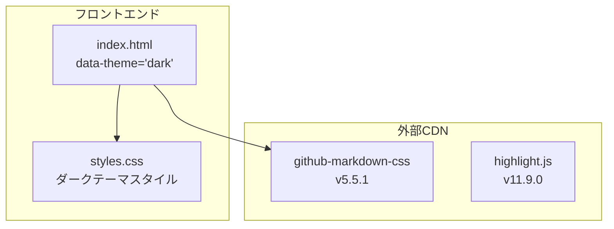

# UIスタイル 設計

関連: [requirements](requirements.md)

## 概要

**目的**: この機能はmd-openユーザーにダークテーマを提供します。
**ユーザー**: マークダウンプレビューを使用する開発者がコードレビューや文書確認のためにこれを利用します。
**影響**: styles.css、index.htmlの変更によってダークテーマを適用します。

## ゴール

- GitHub Dark配色（`#0d1117` ベース）を採用する
- ページ全体にモノスペースフォントを適用する
- サイドバー、コンテンツエリア、シンタックスハイライト、mermaidすべてをダークテーマに統一する

## 非ゴール

- テーマ切り替え機能（ライト/ダーク切り替えUI）は実装しない
- システム設定（prefers-color-scheme）への追従は実装しない
- 常にダークテーマ固定とする

## アーキテクチャ

### アーキテクチャパターンと境界マップ



**アーキテクチャ統合**:
- 選択されたパターン: CSS変数ベースのテーマ適用
- 既存パターン: 2カラムレイアウト（サイドバー + コンテンツ）を維持
- 新規コンポーネントの根拠: なし（既存ファイルの変更のみ）

### 技術スタック

| レイヤー | 選択/バージョン | 機能における役割 | 備考 |
|--------|---------------|----------------|-----|
| マークダウンCSS | github-markdown-css v5.5.1 | ダークテーマ配色 | CDN、data-theme属性で制御 |
| シンタックス | highlight.js v11.9.0 | コードハイライト | CDNテーマ（github-dark.min.css）を使用 |
| カスタムCSS | styles.css | サイドバー、レイアウト | ダーク配色を実装 |

## 要件トレーサビリティ

| 要件 | 概要 | コンポーネント | インターフェース |
|------|------|--------------|----------------|
| 1.1-1.5 | ダークテーマ配色 | styles.css, index.html | data-theme属性、CSS変数 |
| 2.1-2.2 | フォント設定 | styles.css | font-family |
| 3.1-3.6 | サイドバー | styles.css | .sidebar, #file-list |
| 4.1 | シンタックスハイライト | index.html | CDNテーマ読み込み |
| 5.1-5.3 | スクロールバー | styles.css | ::-webkit-scrollbar |
| 6.1-6.4 | コンテンツエリア | styles.css | .markdown-body |

## コンポーネントとインターフェース

### index.html

| フィールド | 詳細 |
|----------|------|
| 意図 | ダークテーマを有効化するためのdata-theme属性設定 |
| 要件 | 1.5 |

**変更内容**:
- body要素に `data-theme="dark"` 属性を追加
- highlight.jsのCDNテーマ（github-dark.min.css）を読み込み

### styles.css

| フィールド | 詳細 |
|----------|------|
| 意図 | ダークテーマのスタイル定義 |
| 要件 | 1.1-1.4, 2.1-2.2, 3.1-3.6, 5.1-5.3, 6.1-6.4 |

**責任と制約**:
- ダーク配色を実装
- github-markdown-cssのCSS変数を活用

## ライブラリ使用仕様

### github-markdown-css

| API | 説明 | 使用例 |
|-----|------|-------|
| data-theme属性 | ダークテーマ有効化 | `<body data-theme="dark">` |
| CSS変数 | 色定義 | `var(--color-canvas-default)` |

## コーディングパターン

### CDNテーマによるシンタックスハイライト

```html
<link rel="stylesheet" href="https://cdnjs.cloudflare.com/ajax/libs/highlight.js/11.9.0/styles/github-dark.min.css">
```

### data-theme属性によるテーマ適用

```html
<body data-theme="dark">
```

## テスト戦略

### 手動確認項目

- ページ背景色が `#0d1117` であること
- サイドバーが適切なダーク配色であること
- コードブロックのシンタックスハイライトが正しく表示されること
- mermaidダイアグラムがダークテーマで表示されること

## 影響範囲

| 影響を受ける機能 | 影響の内容 | 影響レベル | 軽減策 |
|----------------|----------|----------|-------|
| 既存のライトテーマ | 完全に置き換え | 高 | ダークテーマ固定の仕様として明確化 |

## 注意事項

| カテゴリ | 注意点 | 詳細説明 | 防止策 |
|--------|-------|---------|-------|
| CDN | github-markdown-cssのバージョン | 異なるバージョンではCSS変数名が変わる可能性 | バージョン固定（v5.5.1） |
| ブラウザ互換性 | CSS変数のサポート | IE11以下では動作しない | モダンブラウザを対象とする |
