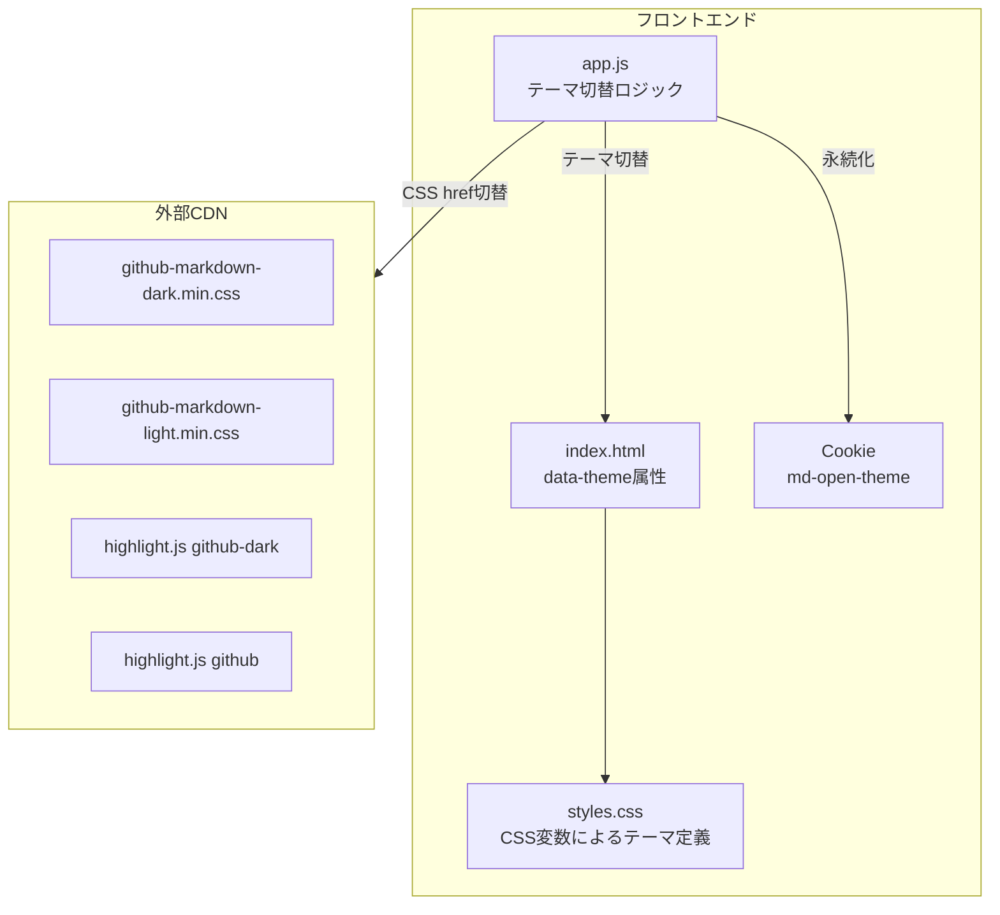

# UIスタイル 設計

関連: [requirements](requirements.md)

## 概要

**目的**: この機能はmd-openユーザーにダーク/ライトテーマを提供し、切り替え可能にします。
**ユーザー**: マークダウンプレビューを使用する開発者がコードレビューや文書確認のためにこれを利用します。
**影響**: styles.css、index.html、app.jsの変更によってテーマ切り替えを実現します。

## ゴール

- GitHub Dark配色（`#0d1117` ベース）を採用する
- GitHub Light配色（`#ffffff` ベース）を追加する
- ページ全体にモノスペースフォントを適用する
- サイドバー、コンテンツエリア、シンタックスハイライト、mermaidすべてを選択テーマに統一する
- テーマ設定をCookieに永続化する（ポート変更時もlocalhost全体で共有）
- 初回アクセス時はシステム設定（prefers-color-scheme）に追従する

## 非ゴール

- 3つ以上のテーマバリエーション（ライト/ダークの2種類のみ）
- サーバーサイドでのテーマ設定ファイル保存
- カスタムカラーの設定UI

## アーキテクチャ

### アーキテクチャパターンと境界マップ



**アーキテクチャ統合**:
- 選択されたパターン: CSS変数ベースのテーマ適用 + CDNスタイルシート動的切替
- 既存パターン: 2カラムレイアウト（サイドバー + コンテンツ）を維持
- 新規コンポーネント: テーマトグルボタン（ページ右上固定配置）

### 技術スタック

| レイヤー | 選択/バージョン | 機能における役割 | 備考 |
|--------|---------------|----------------|-----|
| マークダウンCSS | github-markdown-css v5.5.1 | テーマ別配色 | CDN、dark/lightの2ファイルを動的切替 |
| シンタックス | highlight.js v11.9.0 | コードハイライト | CDNテーマを動的切替 |
| カスタムCSS | styles.css | サイドバー、レイアウト、テーマトグル | CSS変数で配色を管理 |
| 永続化 | Cookie | テーマ設定の保存 | キー: `md-open-theme` |

## 要件トレーサビリティ

| 要件 | 概要 | コンポーネント | インターフェース |
|------|------|--------------|----------------|
| 1.1-1.5 | ダークテーマ配色 | styles.css, index.html | data-theme属性、CSS変数 |
| 2.1-2.2 | フォント設定 | styles.css | font-family |
| 3.1-3.6 | サイドバー（ダーク） | styles.css | .sidebar, #file-list |
| 4.1 | シンタックスハイライト | index.html | CDNテーマ読み込み |
| 5.1-5.3 | スクロールバー | styles.css | ::-webkit-scrollbar |
| 6.1-6.4 | コンテンツエリア | styles.css | .markdown-body |
| 7.1-7.5 | ライトテーマ配色 | styles.css | CSS変数 |
| 8.1-8.6 | テーマ切替 | app.js, index.html | トグルボタン、Cookie |
| 9.1-9.6 | ライトテーマのサイドバー | styles.css | CSS変数 |
| 10.1-10.3 | ライトテーマのスクロールバー | styles.css | CSS変数 |
| 11.1-11.4 | ライトテーマのコンテンツエリア | styles.css | CSS変数 |
| 12.1-12.2 | ライトテーマのシンタックスハイライト | app.js | CDN href動的切替 |
| 13.1-13.3 | tmuxパネルのテーマ対応 | styles.css, app.js | CSS変数、ttyd iframe再読込 |

## 設計決定

### 決定1: CSS変数によるテーマカラー管理

**What**: ハードコードされた色値をCSS変数に置き換え、data-theme属性でテーマを切り替える

**How**:
- ファイル: `public/styles.css`
- 実装方針: `[data-theme="dark"]` と `[data-theme="light"]` のセレクタでCSS変数を定義し、各コンポーネントの色指定を `var()` に置換

**Why（Core）**:

なぜこのアプローチ？
→ CSS変数により、テーマ切替時にJSから色の個別変更が不要。data-theme属性の変更だけで全コンポーネントの色が連動する

なぜ別CSSファイルではなくCSS変数？
→ レイアウト等の共通スタイルとの分離が不要で、1ファイルで完結する。既存構造の大幅な変更を避けられる

**検討した選択肢**:
- **CSS変数 + data-theme属性（採用）**: 1ファイルで完結、切替コストが最小
- **テーマ別CSSファイル分離（却下）**: ファイル管理が複雑化し、共通スタイルの重複が発生
- **CSSクラス切替（却下）**: CSS変数と比べてセレクタの記述量が増大

### 決定2: CDNスタイルシートの動的切替

**What**: github-markdown-cssとhighlight.jsのCDNスタイルシートをテーマに応じて動的に切り替える

**How**:
- ファイル: `public/app.js`, `public/index.html`
- 実装方針: link要素にid属性を付与し、JSからhref属性を書き換える

**Why（Core）**:

なぜこのアプローチ？
→ github-markdown-cssはdark/lightで別ファイルが提供されており、CSS変数での上書きは困難。CDN提供のファイルを直接切り替えるのが最も確実

なぜ両方のCSSを読み込んで無効化する方式ではないか？
→ 不要なCSSの読み込みを避けることで、初期表示のパフォーマンスを維持できる

### 決定3: Cookieによるテーマ永続化

**What**: テーマ設定をCookieに保存し、次回アクセス時に復元する

**How**:
- ファイル: `public/app.js`
- Cookie名: `md-open-theme`
- 値: `"light"` | `"dark"`
- 属性: `path=/; max-age=31536000; SameSite=Lax`
- 初回（未保存時）: `window.matchMedia('(prefers-color-scheme: dark)')` でシステム設定を参照

**Why（Core）**:

なぜCookie？
→ Cookieはポートをスコープに含めないため、localhostの全ポートで設定が共有される。md-open-browserはポート競合時に自動でポートを変更するため、localStorageではポート毎に設定が分離してしまう

なぜlocalStorageではないか？
→ localStorageはorigin（プロトコル+ホスト+ポート）単位でスコープされる。ポートが変わると設定が失われるため、CLIツールの用途に不適合

なぜサーバーサイドファイル保存ではないか？
→ APIエンドポイント追加が必要で実装が複雑化する。Cookieで十分な要件を満たせる

### 決定4: テーマトグルボタンの配置

**What**: コンテンツエリアの右上にテーマ切替ボタンを配置する（スクロール追従、固定配置ではない）

**How**:
- ファイル: `public/index.html`, `public/styles.css`, `public/app.js`
- 配置: `.preview-container` 内に `float: right; margin: 12px 16px 0 0` で配置
- アイコン: テキストベースの太陽/月アイコン
- 構造: `article#preview` と共に `.preview-container`（スクロールコンテナ）内に配置

**Why（Core）**:

なぜ固定配置ではなくフロー配置？
→ `position: fixed` ではtmuxキャッチアップパネル（Claude Codeサジェスト）と重なる問題がある。コンテンツエリア内のフロー配置にすることで、他のUI要素と干渉しない

なぜ `.preview-container` ラッパーが必要？
→ `#preview` の `innerHTML` はマークダウンレンダリング時に上書きされるため、ボタンを `#preview` 内に置けない。スクロールコンテナとして `.preview-container` を設け、ボタンと `#preview` を兄弟要素として配置する

なぜSVGアイコンライブラリではなくテキストベース？
→ 外部依存を増やさない。CLIツールとして軽量さを維持する

## コンポーネントとインターフェース

### index.html

| フィールド | 詳細 |
|----------|------|
| 意図 | テーマ属性の設定、CDNスタイルシートの切替基盤、トグルボタンの配置 |
| 要件 | 1.5, 7.5, 8.1 |

**変更内容**:
- body要素の `data-theme` 属性を初期値なし（JSが設定）に変更
- CDNのlink要素にid属性を付与（`id="markdown-css"`, `id="hljs-css"`）
- `.preview-container` ラッパーを追加（スクロールコンテナ）
- テーマトグルボタン要素を `.preview-container` 内に追加

### styles.css

| フィールド | 詳細 |
|----------|------|
| 意図 | CSS変数によるテーマ定義、トグルボタンのスタイル |
| 要件 | 1.1-1.4, 2.1-2.2, 3.1-3.6, 5.1-5.3, 6.1-6.4, 7.1-7.5, 9.1-9.6, 10.1-10.3, 11.1-11.4 |

**責任と制約**:
- CSS変数でダーク/ライト両テーマの配色を定義
- 全コンポーネントの色指定を `var()` に置換
- github-markdown-cssのCSS変数は各テーマのCDNファイルが提供するため上書き不要
- `.preview-container` がスクロールコンテナを担当（`.markdown-body` からスクロール責務を分離）
- テーマトグルボタンは `float: right` でコンテンツエリア内に配置（`position: fixed` ではない）

### app.js

| フィールド | 詳細 |
|----------|------|
| 意図 | テーマ切替ロジック、永続化、CDN動的切替 |
| 要件 | 8.1-8.6, 12.1-12.2, 13.1-13.3 |

**責任と制約**:
- 初期化時にCookieまたはシステム設定からテーマを決定
- トグルボタンのクリックハンドラ
- CDN link要素のhref切替
- mermaidテーマの再初期化
- ttyd iframe（存在する場合）のテーマ再適用

## ライブラリ使用仕様

### github-markdown-css

| API | 説明 | 使用例 |
|-----|------|-------|
| data-theme属性 | テーマ有効化 | `<body data-theme="dark">` or `<body data-theme="light">` |
| CSS変数 | 色定義 | `var(--color-canvas-default)` |
| dark CSS | ダーク配色 | `github-markdown-dark.min.css` |
| light CSS | ライト配色 | `github-markdown-light.min.css` |

### highlight.js

| API | 説明 | 使用例 |
|-----|------|-------|
| dark theme | ダーク配色 | `styles/github-dark.min.css` |
| light theme | ライト配色 | `styles/github.min.css` |

## コーディングパターン

### CSS変数によるテーマ定義

```css
[data-theme="dark"] {
  --bg-primary: #0d1117;
  --bg-secondary: #161b22;
  --text-primary: #e6edf3;
  --border-color: #30363d;
}

[data-theme="light"] {
  --bg-primary: #ffffff;
  --bg-secondary: #f6f8fa;
  --text-primary: #1f2328;
  --border-color: #d0d7de;
}
```

### テーマ初期化と切替

```javascript
function getPreferredTheme() {
  const stored = Cookie.getItem('md-open-theme');
  if (stored) return stored;
  return window.matchMedia('(prefers-color-scheme: dark)').matches ? 'dark' : 'light';
}

function setTheme(theme) {
  document.body.setAttribute('data-theme', theme);
  // CDN切替、mermaid再初期化、Cookie保存
}
```

## テスト戦略

### 手動確認項目

- ダークテーマ: ページ背景色が `#0d1117` であること
- ライトテーマ: ページ背景色が `#ffffff` であること
- テーマ切替後もサイドバー、コードブロック、mermaidの配色が統一されていること
- ページリロード後にテーマ設定が維持されること
- Cookieが空の場合、システムのprefers-color-schemeに追従すること
- トグルボタンが常にアクセス可能であること
- tmuxパネル（ttyd含む）がテーマに追従すること

## 影響範囲

| 影響を受ける機能 | 影響の内容 | 影響レベル | 軽減策 |
|----------------|----------|----------|-------|
| 既存のダークテーマ固定 | ライトテーマが追加され、切替可能に | 中 | デフォルトはシステム設定に追従 |
| ttyd iframe | テーマ切替時にiframeの再読込が必要 | 低 | テーマ変更時のみ再読込 |

## 注意事項

| カテゴリ | 注意点 | 詳細説明 | 防止策 |
|--------|-------|---------|-------|
| CDN | github-markdown-cssのバージョン | 異なるバージョンではCSS変数名が変わる可能性 | バージョン固定（v5.5.1） |
| ブラウザ互換性 | CSS変数のサポート | IE11以下では動作しない | モダンブラウザを対象とする |
| FOUC | テーマ初期化前のちらつき | JSが実行されるまでテーマが未適用の可能性 | index.htmlのhead内にインラインスクリプトでテーマを即座に適用 |
