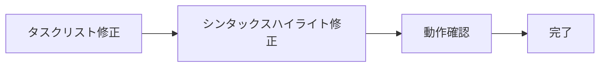

# レンダリングテスト

このファイルは、タスクリストとコードブロックのレンダリングを確認するためのテストファイルです。

## タスクリスト（番号付き）

- [x] 1. プロジェクト初期設定
- [x] 2. ダークテーマの実装
- [ ] 3. レンダリングバグの修正
- [ ] 4. テストの追加

## タスクリスト（通常）

- [x] 完了したタスク
- [ ] 未完了のタスク

## TypeScriptコードブロック

```typescript
interface User {
  id: number;
  name: string;
  email: string;
}

function greetUser(user: User): string {
  return `Hello, ${user.name}!`;
}

const user: User = {
  id: 1,
  name: "Alice",
  email: "alice@example.com"
};

console.log(greetUser(user));
```

## JavaScriptコードブロック

```javascript
function calculateSum(a, b) {
  return a + b;
}

const result = calculateSum(10, 20);
console.log(`Result: ${result}`);
```

## Pythonコードブロック

```python
def fibonacci(n):
    if n <= 1:
        return n
    return fibonacci(n-1) + fibonacci(n-2)

# フィボナッチ数列の10番目の要素を計算
print(fibonacci(10))
```

## 言語指定なしのコードブロック

```
This is a code block without language specification.
It should have auto-detected syntax highlighting.
```

## Mermaidダイアグラム


