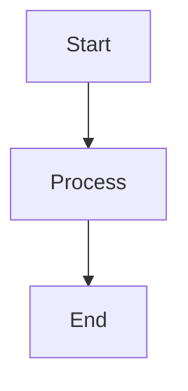

# Test File 1

This is a test markdown file.

## Code Block

```javascript
function hello() {
  console.log("Hello, world!");
}
```

## Mermaid Diagram



## Table

| Name | Age |
|------|-----|
| Alice | 25 |
| Bob | 30 |
